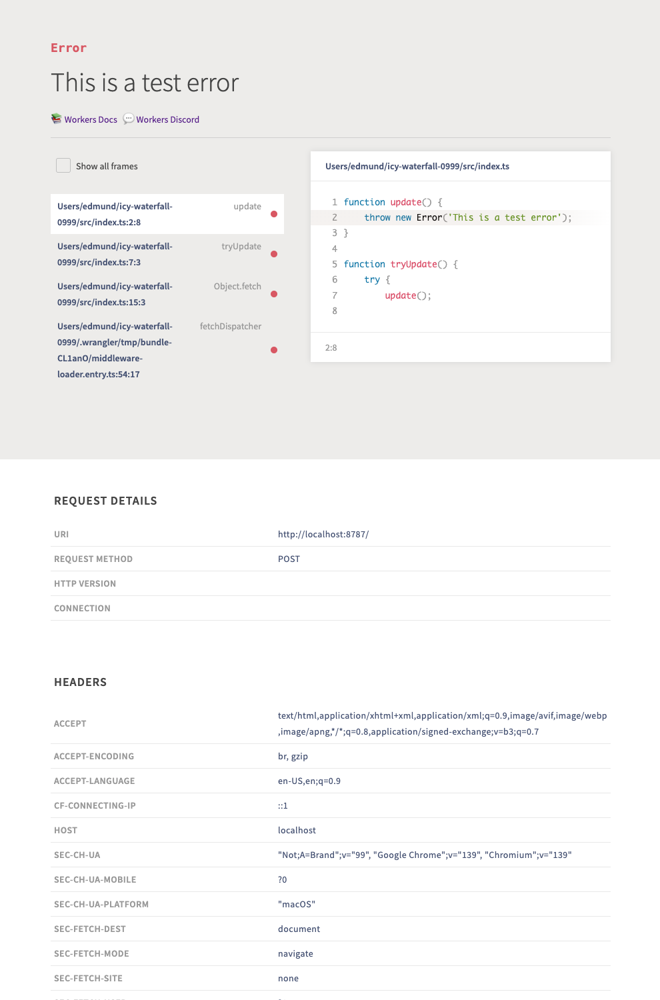
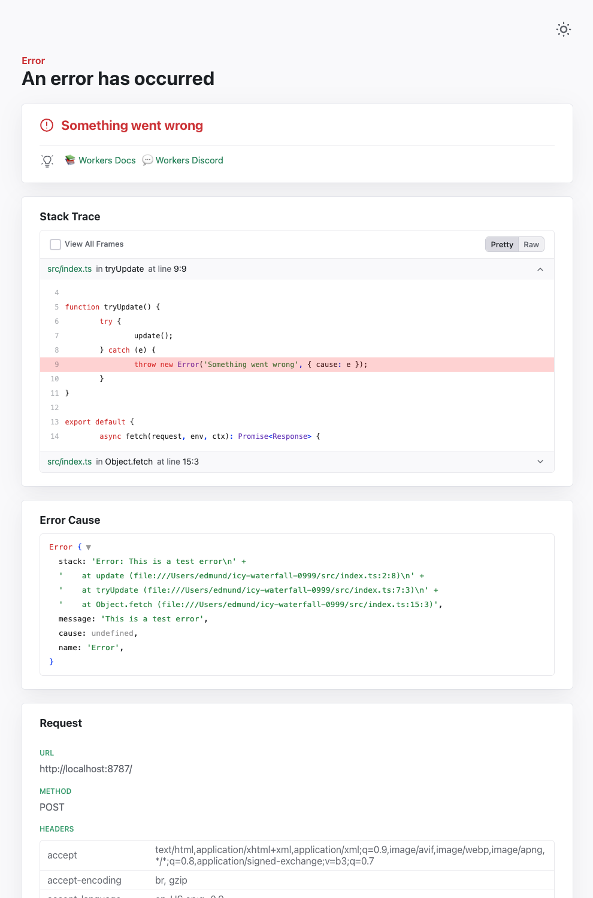
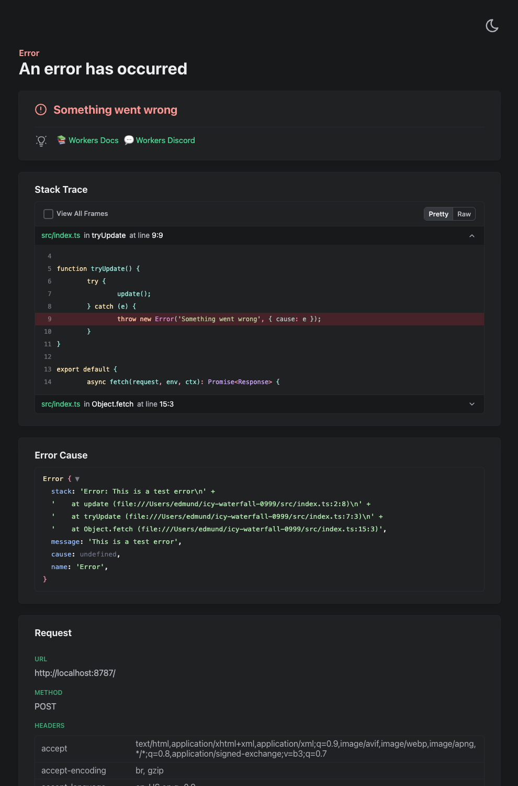

Wrangler's error screen has received several improvements to enhance your debugging experience!

The error screen now features a refreshed design thanks to [youch](https://www.npmjs.com/package/youch), with support for both light and dark themes, improved source map resolution logic that handles missing source files more reliably, and better error cause display.

| Before | After (Light) | After (Dark) |
|--------|---------------|--------------|
|  |  |  |

Try it out now with `npx wrangler@latest dev` in your Workers project.
