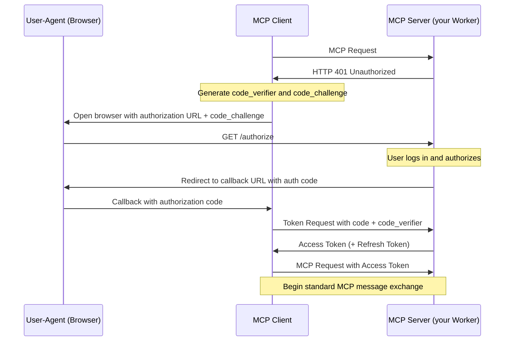
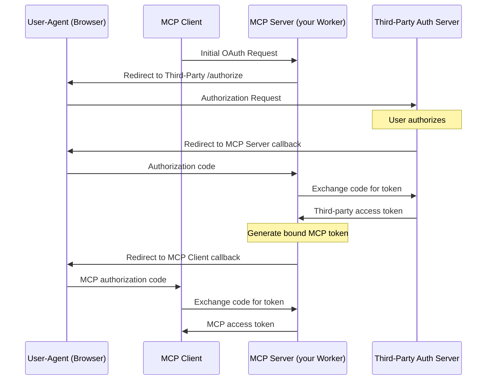

import { DirectoryListing } from "~/components";

When building a [Model Context Protocol (MCP)](https://modelcontextprotocol.io) server, you need both a way to allow users to login (authentication) and allow them to grant the MCP client access to resources on their account (authorization).

<diagram>

</diagram>

The Model Context Protocol uses [a subset of OAuth 2.1 for authorization](https://spec.modelcontextprotocol.io/specification/draft/basic/authorization/). OAuth allows your users to grant limited access to resources, without them having to share API keys or other credentials.

Cloudflare provides an [OAuth Provider Library](https://github.com/cloudflare/workers-oauth-provider) that implements the provider side of the OAuth 2.1 protocol, allowing you to easily add authorization to your MCP server.

You can use the OAuth Provider Library in three ways:

1. **Your Worker handles authorization itself.** Your MCP server, running on Cloudflare, handles the complete OAuth flow. ([Example](/agents/guides/remote-mcp-server/))
2. **Integrate directly with a third-party OAuth provider**, such as GitHub or Google.
3. **Integrate with your own OAuth provider**, including authorization-as-a-service providers you might already rely on, such as Stytch, Auth0, or WorkOS.

The following sections describe each of these options and link to runnable code examples for each.

## Authorization options

### (1) Your MCP Server handles authorization and authentication itself

Your MCP Server, using the [OAuth Provider Library](https://github.com/cloudflare/workers-oauth-provider), can handle the complete OAuth authorization flow, without any third-party involvement.

The [Workers OAuth Provider Library](https://github.com/cloudflare/workers-oauth-provider) is a Cloudflare Worker that implements a [`fetch()` handler](/workers/runtime-apis/handlers/fetch/), and handles incoming requests to your MCP server.

You provide your own handlers for your MCP Server's API, and authentication and authorization logic, and URI paths for the OAuth endpoints, as shown below:

```ts
export default new OAuthProvider({
	apiRoute: "/mcp",
	// Your MCP server:
	apiHandler: MyMCPServer.Router,
	// Your handler for authentication and authorization:
	defaultHandler: MyAuthHandler,
	authorizeEndpoint: "/authorize",
	tokenEndpoint: "/token",
	clientRegistrationEndpoint: "/register",
});
```

Refer to the [getting started example](/agents/guides/remote-mcp-server/) for a complete example of the `OAuthProvider` in use, with a mock authentication flow.

The authorization flow in this case works like this:



Remember — [authentication is different from authorization](https://www.cloudflare.com/learning/access-management/authn-vs-authz/). Your MCP Server can handle authorization itself, while still relying on an external authentication service to first authenticate users. The [example](/agents/guides/remote-mcp-server) in getting started provides a mock authentication flow. You will need to implement your own authentication handler — either handling authentication yourself, or using an external authentication services.

### (2) Cloudflare Access integration

You can use Cloudflare Access as a Single Sign-On (SSO) provider to authorize users to your MCP server. Users log in using a [configured identity provider](/cloudflare-one/integrations/identity-providers/) or a [one-time PIN](/cloudflare-one/integrations/identity-providers/one-time-pin/), and they are only granted access if their identity matches your [Access policies](/cloudflare-one/access-controls/policies/).

To deploy an [example MCP server](https://github.com/cloudflare/ai/tree/main/demos/remote-mcp-cf-access) with Cloudflare Access as the OAuth provider, refer to [Secure MCP servers with Access for SaaS](/cloudflare-one/access-controls/ai-controls/saas-mcp/).

### (3) Third-party OAuth Provider

The [OAuth Provider Library](https://github.com/cloudflare/workers-oauth-provider) can be configured to use a third-party OAuth provider, such as GitHub or Google. You can see a complete example of this in the [GitHub example](/agents/guides/remote-mcp-server/#add-authentication).

When you use a third-party OAuth provider, you must provide a handler to the `OAuthProvider` that implements the OAuth flow for the third-party provider.

```ts ins="defaultHandler: MyAuthHandler,"
import MyAuthHandler from "./auth-handler";

export default new OAuthProvider({
	apiRoute: "/mcp",
	// Your MCP server:
	apiHandler: MyMCPServer.Router,
	// Replace this handler with your own handler for authentication and authorization with the third-party provider:
	defaultHandler: MyAuthHandler,
	authorizeEndpoint: "/authorize",
	tokenEndpoint: "/token",
	clientRegistrationEndpoint: "/register",
});
```

Note that as [defined in the Model Context Protocol specification](https://spec.modelcontextprotocol.io/specification/draft/basic/authorization/#292-flow-description) when you use a third-party OAuth provider, the MCP Server (your Worker) generates and issues its own token to the MCP client:



Read the docs for the [Workers oAuth Provider Library](https://github.com/cloudflare/workers-oauth-provider) for more details.

### (4) Bring your own OAuth Provider

If your application already implements an OAuth Provider itself, or you use authorization-as-a-service provider, you can use this in the same way that you would use a third-party OAuth provider, described above in (2).

You can use the auth provider to:

- Allow users to authenticate to your MCP server through email, social logins, SSO (single sign-on), and MFA (multi-factor authentication).
- Define scopes and permissions that directly map to your MCP tools.
- Present users with a consent page corresponding with the requested permissions.
- Enforce the permissions so that agents can only invoke permitted tools.

#### Stytch

Get started with a [remote MCP server that uses Stytch](https://stytch.com/docs/guides/connected-apps/mcp-servers) to allow users to sign in with email, Google login or enterprise SSO and authorize their AI agent to view and manage their company's OKRs on their behalf. Stytch will handle restricting the scopes granted to the AI agent based on the user's role and permissions within their organization. When authorizing the MCP Client, each user will see a consent page that outlines the permissions that the agent is requesting that they are able to grant based on their role.

[](https://deploy.workers.cloudflare.com/?url=https://github.com/cloudflare/ai/tree/main/demos/mcp-stytch-b2b-okr-manager)

For more consumer use cases, deploy a remote MCP server for a To Do app that uses Stytch for authentication and MCP client authorization. Users can sign in with email and immediately access the To Do lists associated with their account, and grant access to any AI assistant to help them manage their tasks.

[](https://deploy.workers.cloudflare.com/?url=https://github.com/cloudflare/ai/tree/main/demos/mcp-stytch-consumer-todo-list)

#### Auth0

Get started with a remote MCP server that uses Auth0 to authenticate users through email, social logins, or enterprise SSO to interact with their todos and personal data through AI agents. The MCP server securely connects to API endpoints on behalf of users, showing exactly which resources the agent will be able to access once it gets consent from the user. In this implementation, access tokens are automatically refreshed during long running interactions.

To set it up, first deploy the protected API endpoint:

[](https://deploy.workers.cloudflare.com/?url=https://github.com/cloudflare/ai/tree/main/demos/remote-mcp-auth0/todos-api)

Then, deploy the MCP server that handles authentication through Auth0 and securely connects AI agents to your API endpoint.

[](https://deploy.workers.cloudflare.com/?url=https://github.com/cloudflare/ai/tree/main/demos/remote-mcp-auth0/mcp-auth0-oidc)

#### WorkOS

Get started with a remote MCP server that uses WorkOS's AuthKit to authenticate users and manage the permissions granted to AI agents. In this example, the MCP server dynamically exposes tools based on the user's role and access rights. All authenticated users get access to the `add` tool, but only users who have been assigned the `image_generation` permission in WorkOS can grant the AI agent access to the image generation tool. This showcases how MCP servers can conditionally expose capabilities to AI agents based on the authenticated user's role and permission.

[](https://deploy.workers.cloudflare.com/?url=https://github.com/cloudflare/ai/tree/main/demos/remote-mcp-authkit)

#### Descope

Get started with a remote MCP server that uses [Descope](https://www.descope.com/) Inbound Apps to authenticate and authorize users (for example, email, social login, SSO) to interact with their data through AI agents. Leverage Descope custom scopes to define and manage permissions for more fine-grained control.

[](https://deploy.workers.cloudflare.com/?url=https://github.com/cloudflare/ai/tree/main/demos/remote-mcp-server-descope-auth)

## Using Authentication Context in Your MCP Server

When a user authenticates to your MCP server through Cloudflare's OAuth Provider, their identity information and tokens are made available through the `props` parameter.

```js
export class MyMCP extends McpAgent<Env, unknown, AuthContext> {
  async init() {
    this.server.tool("userInfo", "Get user information", {}, async () => ({
      content: [{ type: "text", text: `Hello, ${this.props.claims.name || "user"}!` }],
    }));
  }
}
```

The authentication context can be used for:

- Accessing user-specific data by using the user ID (this.props.claims.sub) as a key
- Checking user permissions before performing operations
- Customizing responses based on user preferences or attributes
- Using authentication tokens to make requests to external services on behalf of the user
- Ensuring consistency when users interact with your application through different interfaces (dashboard, API, MCP server)

## Implementing Permission-Based Access for MCP Tools

You can implement fine-grained authorization controls for your MCP tools based on user permissions. This allows you to restrict access to certain tools based on the user's role or specific permissions.

```js
// Create a wrapper function to check permissions
function requirePermission(permission, handler) {
  return async (request, context) => {
    // Check if user has the required permission
    const userPermissions = context.props.permissions || [];
    if (!userPermissions.includes(permission)) {
      return {
        content: [{ type: "text", text: `Permission denied: requires ${permission}` }],
        status: 403
      };
    }

    // If permission check passes, execute the handler
    return handler(request, context);
  };
}

// Use the wrapper with your MCP tools
async init() {
  // Basic tools available to all authenticated users
  this.server.tool("basicTool", "Available to all users", {}, async () => {
    // Implementation for all users
  });

  // Protected tool using the permission wrapper
  this.server.tool(
    "adminAction",
    "Administrative action requiring special permission",
    { /* parameters */ },
    requirePermission("admin", async (req) => {
      // Only executes if user has "admin" permission
      return {
        content: [{ type: "text", text: "Admin action completed" }]
      };
    })
  );

  // Conditionally register tools based on user permissions
  if (this.props.permissions?.includes("special_feature")) {
    this.server.tool("specialTool", "Special feature", {}, async () => {
      // This tool only appears for users with the special_feature permission
    });
  }
}
```

Benefits:

- Authorization check at the tool level ensures proper access control
- Allows you to define permission checks once and reuse them across tools
- Provides clear feedback to users when permission is denied
- Can choose to only present tools that the agent is able to call

## Next steps

- [Learn how to use the Workers OAuth Provider Library](https://github.com/cloudflare/workers-oauth-provider)
- Learn how to use a third-party OAuth provider, using the [GitHub](/agents/guides/remote-mcp-server/#add-authentication) example MCP server.
