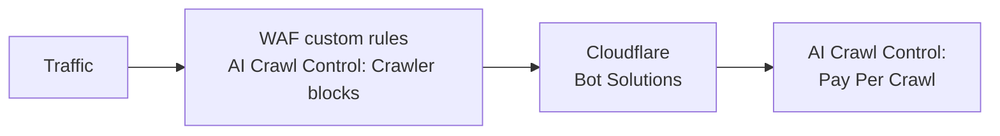

import { GlossaryTooltip, Example } from "~/components";

AI Crawl Control works alongside other Cloudflare products, such as Cloudflare [bot solutions](/bots/). Bot solutions identifies traffic matching patterns of known bots, and can challenge or block the bots as you wish.

## Order of precedence

- AI Crawl Control's AI crawler blocking uses [WAF custom rules](/waf/custom-rules/), which take place before Cloudflare bot solutions.
- AI Crawl Control's pay per crawl takes place after Cloudflare bot solutions.

For more information on how Cloudflare bot solutions works with WAF custom rules, refer to [How it works](/bots/concepts/bot/#how-it-works).

## Examples

Consider the following examples.

### Bot rule which blocks all AI bots vs pay per crawl

You may have both of the following enabled:

- A selection of AI crawlers to be charged through AI Crawl Control's pay per crawl
- Bot configuration option to [Block AI Bots](/bots/get-started/bot-fight-mode/#block-ai-bots).

Since pay per crawl happens after bot solutions, you need to first turn off **Block AI Bots** to ensure pay per crawl works as intended.