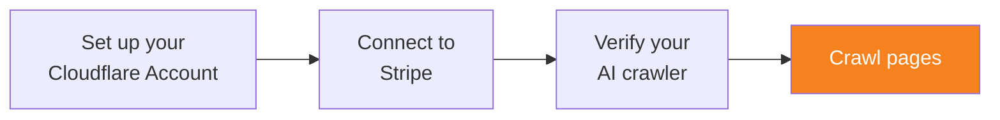

import { Steps } from "~/components";



Once your AI crawler complies with Web Bot Auth, you can begin to crawl webpages. For more information on how pay per crawl works, refer to [What is Pay Per Crawl?](/ai-crawl-control/features/pay-per-crawl/what-is-pay-per-crawl/)

## 1. Identify payment requirements

When an AI crawler makes a request to a page protected by pay per crawl, the server will respond with `HTTP/2 402 Payment Required`. This response will also include the `crawler-price` header which specifies the cost to access the content. For example, a response may look like the following:

```txt
HTTP/2 402
date: Fri, 06 Jun 2025 08:42:38 GMT
crawler-price: USD 0.01
```

To access this content, the AI crawler must provide headers for paid access.

## 2. Access paid content

### 2.1. Include WBA headers

Include Web Bot Auth headers by following the steps [Sign your requests](/bots/reference/bot-verification/web-bot-auth/#4-after-verification-sign-your-requests)

### 2.2. Include payment headers

Your AI crawler can specify the price it is willing to pay by providing one of two headers:

- `crawler-exact-price`: This is the exact price the AI crawler is configured to pay for access. This value should exactly match the price set in the response header `crawler-price`. Include this header in your second request if your AI crawler first received a HTTP status code 402, and you wish to access the content by paying the `crawler-price`.
- `crawler-max-price`: This is the maximum price the AI crawler is configured to pay for access on any content. Use this option if you wish to access any pay per crawl content with a crawl price equal or lower than the maximum price. If a page's `crawler-price` is higher than your `crawler-max-price`, your AI crawler will receive a HTTP 402 response.

:::note
Note that if a content owner has explicitly blocked your AI crawler (instead of charging your crawler), you cannot access their content, even if you provide `crawler-exact-price` or `crawler-max-price` headers.
:::

### 2.3. Review response headers

When you specify a header to indicate payment, you may receive one of two responses:

#### Successful HTTP/2 200 response

The value of the `crawler-charged` header indicates the exact amount that will be billed to your Cloudflare account for the request.

```txt
HTTP/2 200
date: Fri, 06 Jun 2025 08:42:38 GMT
crawler-charged: USD 0.01
```

#### Unsuccessful HTTP/2 402 response

If the request is unsuccessful due to an incorrect price header, you will receive a response with the `crawler-price` header. Your request header values must be adjusted to match the `crawler-price`.

```txt
HTTP/2 402
date: Fri, 06 Jun 2025 08:42:38 GMT
content-type: text/plain; charset=utf-8
crawler-price: USD 0.01
```

## 3. Track your spending

When you successfully access pay per crawl content (response with HTTP status code 200), the response will include `crawler-charged`. For example:

```
crawler-charged: USD 0.01
```

Cloudflare strongly recommends tracking and saving these values to keep an accurate record of the bill your AI crawler has accrued.

## Additional resources

You may wish to refer to the following resources.

- [Pay Per Crawl FAQs](/ai-crawl-control/features/pay-per-crawl/faq).
