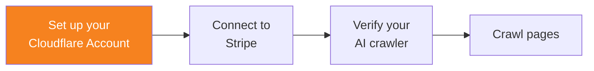

import { Steps } from "~/components";

To begin using pay per crawl, set up your Cloudflare account.

Sign up for a [Cloudflare account](https://dash.cloudflare.com/sign-up).

:::note[Pay per crawl closed beta]
Pay per crawl is currently in closed beta.

To find out how to join the beta program, reach out to us at [Pay per crawl signup](http://www.cloudflare.com/paypercrawl-signup/), or contact your account executive if you are an existing Enterprise customer.

To learn more about pay per crawl, refer to Cloudflare blog: [Introducing pay per crawl: enabling content owners to charge AI crawlers for access](https://blog.cloudflare.com/introducing-pay-per-crawl/).
:::