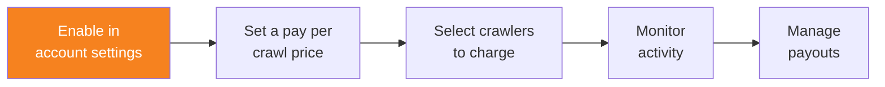

import { Steps, DashButton } from "~/components";

## Prerequisites

To configure pay per crawl, you must have the following:

- **Cloudflare account**: You need an active Cloudflare account with domains added
- **Domain on Cloudflare**: Your domain must be using Cloudflare's nameservers, or have DNS records managed by Cloudflare
- **Administrator access**: You need Administrator or Super Administrator permissions for account-level configuration

## Configure domain access

An Administrator or Super Administrator with access to all domains must select which domains should show the pay per crawl controls:

{/* prettier-ignore */}
<Steps>
1. In the Cloudflare dashboard, go to **Manage Account** > **Settings**.

   <DashButton url="/?to=/:account/configurations" />

2. Select **Pay Per Crawl**.
3. In the **Domain Access** table, select which domains will have pay per crawl configurations visible.
4. Set the **Visibility** to **Visible** for each domain you want to configure.
</Steps>

:::note[Visibility vs Security]
Setting a domain to **Visible** will not affect security rules. This only makes the pay per crawl configuration controls accessible to domain-level administrators.
:::

After completing these steps, domain administrators can set a pay per crawl price and enable pay per crawl for their specific domains.
