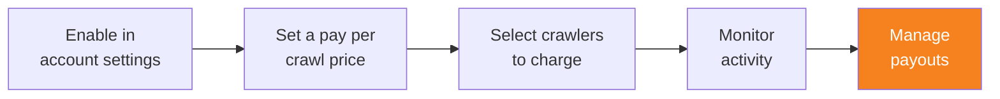

import { Steps, DashButton } from "~/components";

When you're ready to receive payments for your accrued crawler activity, connect your Cloudflare account to Stripe. This step can be completed at any time after enabling pay per crawl.

## Create a new Stripe account

A person with **Administrator** or **Super Administrator** access must set up the Stripe connection:

{/* prettier-ignore */}
<Steps>
1. In the Cloudflare dashboard, go to **Manage Account** > **Settings**.

   <DashButton url="/?to=/:account/configurations" />

2. Select **Pay Per Crawl**.
3. In the **Stripe account** section, select **Connect**.
4. Select **Continue to Stripe**.
5. Complete Stripe's onboarding process, including:
   - Basic business information
   - Bank account details for payouts
</Steps>

:::note[Pay Per Crawl Stripe account required]
You must create a dedicated Cloudflare Stripe Connect account through the dashboard. Pre-existing Stripe accounts are not compatible with this feature.
:::

## Billing lifecycle

Cloudflare manages the complete billing lifecycle:

1. **Charge initiation**: AI crawlers indicate payment intent via request headers
2. **Charge recording**: A charge event is recorded upon successful content delivery (HTTP 200 response)
3. **Aggregation**: Cloudflare aggregates and reconciles all recorded charges
4. **Payout**: Monthly payments to publishers in good standing

### Limitations

- Your accrued balance is not currently visible in the dashboard. You can request balance updates from your Cloudflare team.
- Payouts are subject to settlement periods and minimum payout thresholds.
