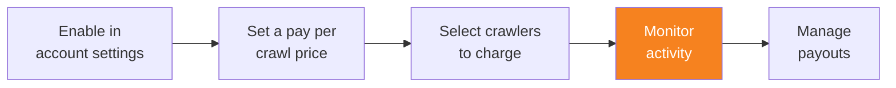

import { Steps, DashButton } from "~/components";

After configuring pay per crawl, monitor crawler activity to understand how AI crawlers interact with your content, and track your earnings.

## View crawler activity

{/* prettier-ignore */}
<Steps>
1. Go to **AI Crawl Control**.

   <DashButton url="/?to=/:account/:zone/ai" />

2. Go to the **Metrics** tab to view detailed analytics.
</Steps>

The metrics help you understand:

- Which crawlers are accessing your content
- How often they are being charged
- Request patterns and trends
- Robots.txt violations

For detailed information about available metrics, refer to [View AI Crawl Control metrics](/ai-crawl-control/features/analyze-ai-traffic/#view-ai-crawl-control-metrics).

:::note[Balance visibility]
Your accrued earnings balance is not currently visible in the dashboard. You can request balance updates from your Cloudflare team.
:::

## Additional considerations

### Robots.txt management

Consider updating your `robots.txt` file to clearly indicate which pages should remain off-limits, even if AI crawlers are willing to pay for access.

### Ongoing optimization

Do the following to ensure you are using pay per crawl most effectively:

- Review crawler activity regularly to identify patterns
- Adjust pricing based on demand and content value
- Modify crawler actions (charge, allow, block) as needed
- Monitor for any unusual or unwanted crawler behavior

## Additional resources

- [Pay Per Crawl FAQs](/ai-crawl-control/features/pay-per-crawl/faq)
- [Analyze AI traffic](/ai-crawl-control/features/analyze-ai-traffic/)
