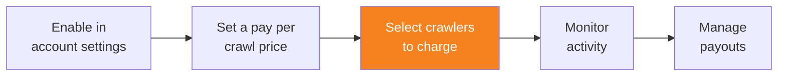

import { Steps, DashButton } from "~/components";

Once you have enabled pay per crawl and set a price, you can specify which AI crawlers to charge for accessing your content.

{/* prettier-ignore */}
<Steps>
1. Go to **AI Crawl Control**.

   <DashButton url="/?to=/:account/:zone/ai" />

2. Go to the **Crawlers** tab.
3. For each crawler, choose an action from the **Actions** column:
   - **Charge**: Charge the set price for successful content access
   - **Allow**: Allow free access without charging
   - **Block**: Block access completely
</Steps>

:::tip[Search Engine Crawlers and SEO]
Use the **Category** column to identify which bots are **Search Engine Crawlers**. Setting these crawlers to **Block** or **Charge** may negatively impact your site's SEO performance, as search engines may not be able to properly index your content.
:::

## Bulk actions

To configure multiple crawlers at once:

{/* prettier-ignore */}
<Steps>
1. Use the filters (Name, Operator, Category) to narrow down the crawler list.
2. Select the crawlers you want to configure by checking their boxes.
3. Bulk action options will appear above the table.
4. Select the desired action and apply the changes.
</Steps>

For more information on managing AI crawlers, refer to [Manage AI crawlers](/ai-crawl-control/features/manage-ai-crawlers/).
