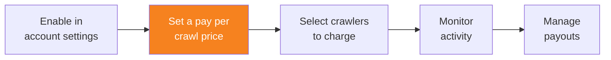

import { Steps, DashButton } from "~/components";

Once your domain's visibility is set to **Visible** in Account Settings, you can set a pay per crawl price and enable pay per crawl for that domain.

{/* prettier-ignore */}
<Steps>
1. Go to **AI Crawl Control**.

   <DashButton url="/?to=/:account/:zone/ai" />

2. Go to the **Settings** tab.
3. In the **Pay Per Crawl** card, select **Enable**.
4. Set your per crawl price - this is the amount charged for each successful content retrieval (HTTP 200 response) by an AI crawler.
5. Select **Save**.
</Steps>

After enabling and setting a price, the domain's status in Account Settings will change to **Enabled**.

:::note[Pricing considerations]
The minimum price is $0.01 USD per crawl. Consider your content value and expected crawler volume when setting your price.
:::
