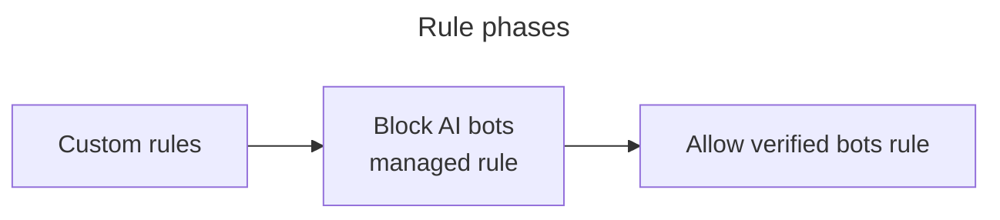

import { Render } from "~/components";

A **bot** is a software application programmed to do certain tasks.

Bots can be used for good (chatbots, search engine crawlers) or for evil (inventory hoarding, credential stuffing).

:::note[More information]

For more background, refer to [What is a bot?](https://www.cloudflare.com/learning/bots/what-is-a-bot/).
:::

## Verified bots and signed agents

<Render file="verified-bots" product="bots" />

:::note
The method for allowing or blocking verified bots depends on [your plan](/bots/concepts/bot/verified-bots/#availability). 
:::

## AI bots

You can opt into a managed rule that will block bots that we categorize as artificial intelligence (AI) crawlers (“AI Bots”) from visiting your website. Customers may choose to do this to prevent AI-related usage of their content, such as training large language models (LLM).

### Which bots are blocked

When you enable this feature, Cloudflare will block the following bots:

- `Amazonbot` (Amazon)
- `Applebot` (Apple)
- `Bytespider` (ByteDance)
- `ClaudeBot` (Anthropic)
- `DuckAssistBot` (DuckDuckGo)
- `Google-CloudVertexBot` (Google)
- `GoogleOther` (Google)
- `GPTBot` (OpenAI)
- `Meta-ExternalAgent` (Meta)
- `PetalBot` (Huawei)
- `TikTokSpider` (ByteDance)
- `CCBot` (Common Crawl)

In addition to this list, [verified bots](https://radar.cloudflare.com/bots#verified-bots) that are classified as AI crawlers, as well as a number of unverified bots that behave similarly, are included in the rule. This rule does not include verified bots that fall into the `Search Engine` categories.

These categories, and the bots classified in these categories, may change from time to time.

If you are a bot operator and feel your bot may have been incorrectly categorized, [add your bot to the list of verified bots](https://dash.cloudflare.com/?to=/:account/configurations/verified-bots).

### How it works

When you enable this feature via a pre-configured managed rule, Cloudflare can detect and block verified AI bots that comply with `robots.txt` and respect crawl rates, and do not hide their behavior from your website. The rule has also been expanded to include more signatures of AI bots that do not follow the rules.

The rule to block AI bots takes precedence over all other Super Bot Fight Mode rules. For example, if you have enabled **Block AI bots** and **Allow verified bots**, verified AI bots will also be blocked even if you allow other verified bots on your website or application.

For Bot Management customers, if you have set a rule to serve managed challenges to definitely automated bots, AI bots will also be challenged because custom rules run in a phase before Super Bot Fight Mode, which is the phase when the rule to block AI bots runs.

This behavior remains the same if the setting for verified, definitely automated, and likely bots is set to `block` or `allow`. If you have an action to `allow` for these rules, the request is not matched to any rule and proceeds to the next ruleset phase. Similarly, if the action is set to `block`, they will be blocked in the earlier phase and do not move on to match the AI rule at all. However, when the action is `challenge`, the request matches a rule and therefore will not be matched to any rules after.

For self-serve non-Bot Management customers, all rules for verified, definitely automated, and likely bots run in the phase following the AI bots rule.

This feature is available on all Cloudflare plans.

:::note

The method for blocking AI bots depends on [your plan](/bots/get-started/).
:::
