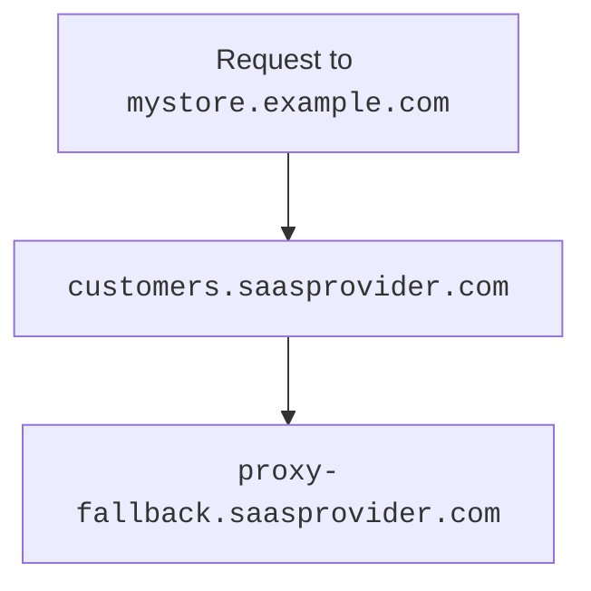

import { Example, Render } from "~/components";

---

<Render
	file="get-started-prereqs"
	params={{ one: "on a Free plan." }}
	product="cloudflare-for-platforms"
/>

---

## Initial setup

<Render
	file="get-started-initial-setup-preamble"
	product="cloudflare-for-platforms"
/>
<br />

### 1. Create fallback origin

<Render file="get-started-fallback-origin" product="cloudflare-for-platforms" />

### 2. (Optional) Create CNAME target

The CNAME target — optional, but highly encouraged — provides a friendly and more flexible place for customers to [route their traffic](#3-have-customer-create-cname-record). You may want to use a subdomain such as `customers.<SAAS_PROVIDER>.com`.

[Create](/dns/manage-dns-records/how-to/create-dns-records/#create-dns-records) a proxied CNAME that points your CNAME target to your fallback origin (can be a wildcard such as `*.customers.saasprovider.com`).

<Example>

| **Type** | **Name**     | **Target**                        | **Proxy status** |
| -------- | ------------ | --------------------------------- | ---------------- |
| `CNAME`  | `.customers` | `proxy-fallback.saasprovider.com` | Proxied          |

</Example>

---

## Per-hostname setup

<Render file="get-started-per-hostname" product="cloudflare-for-platforms" />

### 3. Have customer create CNAME record

To finish the custom hostname setup, your customer needs to set up a CNAME record at their authoritative DNS that points to your [CNAME target](#2-optional-create-cname-target) [^1].

<Render file="get-started-check-statuses" product="cloudflare-for-platforms" />

Your customer's CNAME record might look like the following:

```txt
mystore.example.com CNAME customers.saasprovider.com
```

This record would route traffic in the following way:



<br />

Requests to `mystore.example.com` would go to your CNAME target (`customers.saasprovider.com`), which would then route to your fallback origin (`proxy-fallback.saasprovider.com`).

[^1]:
    <Render file="regional-services" product="cloudflare-for-platforms" />

:::caution
If your customer needs to use an A record to point to the SaaS target, you will need to get [apex proxying](/cloudflare-for-platforms/cloudflare-for-saas/start/advanced-settings/apex-proxying/). By default, using an A record to point to the target is not a supported setup.
:::

#### Service continuation

<Render
	file="get-started-service-continuation"
	product="cloudflare-for-platforms"
/>
