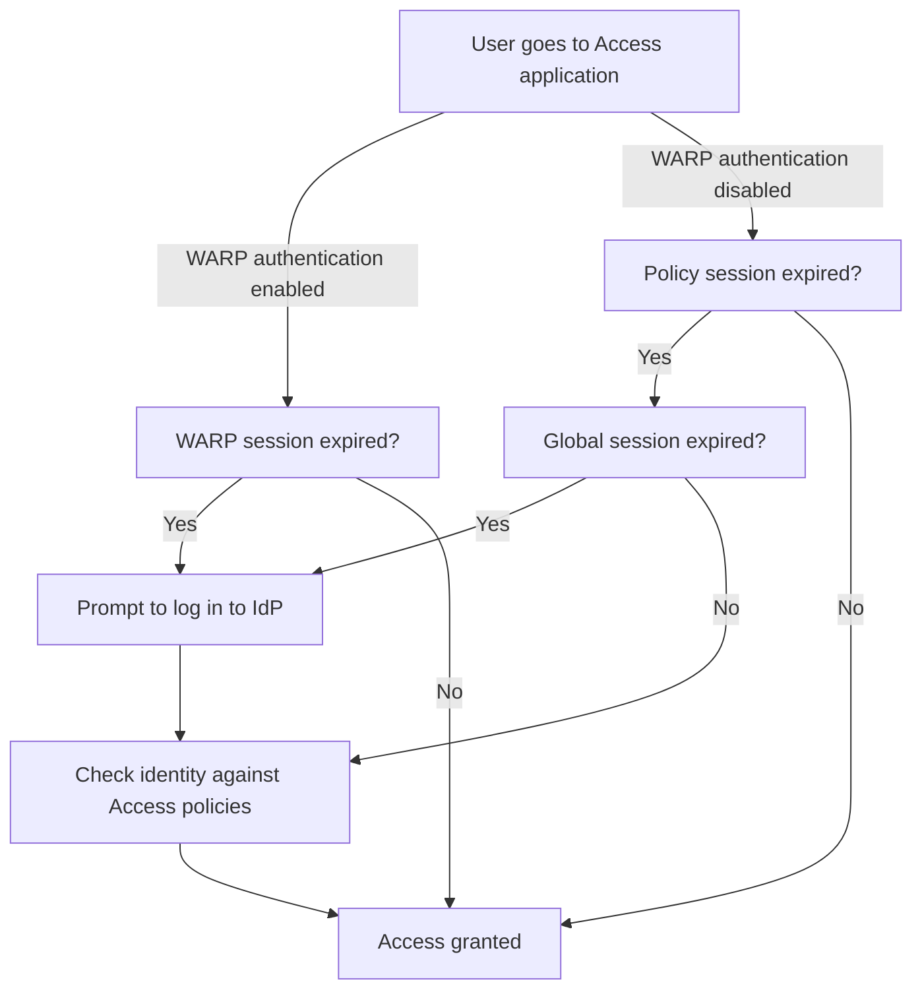

import { GlossaryTooltip, Render } from "~/components";

A user session determines how long a user can access an Access application without re-authenticating.

## Session durations

When a user logs in to an application protected by Access, Access validates their identity against your Access policies and generates two signed JSON Web Tokens (JWTs):

| Token                                                                                 | Description                                                                                                          | Expiration                                                                                                                                       | Storage                                                                           |
| ------------------------------------------------------------------------------------- | -------------------------------------------------------------------------------------------------------------------- | ------------------------------------------------------------------------------------------------------------------------------------------------ | --------------------------------------------------------------------------------- |
| Global session token                                                                  | Stores the user's identity from the IdP and provides single sign-on (SSO) functionality for all Access applications. | [Global session duration](#global-session-duration)                                                                                              | Your Cloudflare <GlossaryTooltip term="team domain">team domain</GlossaryTooltip> |
| [Application token](/cloudflare-one/access-controls/applications/http-apps/authorization-cookie/application-token/) | Allows the user to access a specific Access application.                                                             | [Policy session duration](#policy-session-duration), which defaults to the [application session duration](#application-session-duration) | The hostname protected by the Access application                                  |

The user can access the application for the entire duration of the application token's lifecycle. When the application token expires, Cloudflare will automatically issue a new application token if the global token is still valid (and the user's identity still passes your Access policies). If the global token has also expired, the user will be prompted to re-authenticate with the IdP.

The global token expiration is usually set to equal or exceed the application token expiration. Setting a longer global token provides a more secure way to allow for longer user sessions, since the global token cannot be used to directly access an application.

As an analogy, you can think of the global session like a festival where you buy a ticket to enter for the day. For certain rides or areas, the staff may periodically check your ticket to make sure you are authorized to enter. For example, the backstage area may allow ticket holders to go on a 30 minutes tour, after which you need to sign up for another tour. This is analogous to the app session. Now imagine a special policy exists where VIP ticket holders can go backstage for as long as they want. The VIPs have a policy session duration which overrides the default 30 minutes value.

<Render file="access/one-time-pin-warning" product="cloudflare-one" />

### Global session duration

The global session duration determines how often Cloudflare Access prompts the user to log in to their identity provider. You can set a global session duration between 15 minutes and one month. The default value is 24 hours.

To set the global session duration:

1. In [Cloudflare One](https://one.dash.cloudflare.com), go to **Access controls** > **Access settings**.
2. Under **Set your global session duration**, select **Edit**,
3. Select the desired timeout duration from the dropdown menu.
4. Select **Save**.

The user will be required to re-authenticate with the IdP after this period of time.

### Policy session duration

The policy session duration determines how long the user can access a self-hosted Access application. When the user's session expires, Access rechecks their stored user identity against the application's Access policies.

By default, the policy session duration is equal to the [application session duration](#application-session-duration). To configure more granular permissions for specific users, you can change the policy session duration to a value ranging from immediate timeout to one month. For example, you may wish to set the application session duration to seven days for engineers, but set a policy session duration to 24 hours for contractors.

To set the policy session duration:

1. In [Cloudflare One](https://one.dash.cloudflare.com), go to **Access controls** > **Policies**.
2. Choose a policy and select **Configure**.
3. Select a **Session Duration** from the dropdown menu.
4. Save the policy.

Users who match this policy will be issued an application token with this expiration time.

### Application session duration

The application session duration is the default [policy session duration](#policy-session-duration) for all policies in an Access application. Available session durations range from immediate timeout to one month. The default value is 24 hours.

To set the application session duration:

1. In [Cloudflare One](https://one.dash.cloudflare.com), go to **Access controls** > **Applications**.
2. Choose an application and select **Configure**.
3. Select a **Session Duration** from the dropdown menu.
4. Save the application.

Users who match a policy configured with a _Same as application session timeout_ duration will be issued an application token with this expiration time.

#### SaaS applications

<Render
	file="access/saas-apps/saas-sessions"
	product="cloudflare-one"
	params={{
		session: "Application session durations",
		token: "Access application token",
	}}
/>

#### SSH, RDP, and VNC

<Render file="access/self-hosted-app/ssh-sessions" product="cloudflare-one" />

### WARP session duration

When [WARP authentication identity](/cloudflare-one/team-and-resources/devices/warp/configure-warp/warp-sessions/#configure-warp-sessions-in-access) is enabled for an Access application, the WARP session duration overrides the application and policy session durations. If the global session expires but the user already has a valid WARP session, the user will not need to reauthenticate with the IdP until the WARP session expires, given the user is running WARP.

### Order of enforcement

The following flowchart illustrates how Access enforces user sessions for a self-hosted application.

## Revoke user sessions

Access provides two options for revoking user sessions: per-application and per-user.

### Per-Application

To immediately terminate all active sessions for a specific application:

1. In [Cloudflare One](https://one.dash.cloudflare.com), go to **Access controls** > **Applications**.

2. Locate the application for which you would like to revoke active sessions and select **Configure**.

3. Select **Revoke existing tokens**.

Unless there are changes to rules in the policy, users can start a new session if their profile in your identity provider is still active.

### Per-User

Access can immediately revoke a single user session across all applications in your account. However, if the user's identity profile is still active, they can generate a new session.

If you want to permanently revoke a user's access:

1. Disable their account in your identity provider so that they cannot authenticate.

2. In [Cloudflare One](https://one.dash.cloudflare.com), go to **Team & Resources** > **Users**.

3. Select the checkbox next to the user you want to revoke.

4. Select **Action** > **Revoke**.

The user will no longer be able to log in to any application protected by Access. The user will still count towards your seat subscription until you [remove the user](/cloudflare-one/team-and-resources/users/seat-management) from your account.

### Subsequent Logins

When administrators revoke a user's Cloudflare Access token, that user will not be able to log in again for up to 1 minute. If they attempt to do so, Cloudflare Access will display an error.

## Log out as a user

To log out of Access, the end user can visit either of the following URLs:

- `<your-application-domain>/cdn-cgi/access/logout`
- `<your-team-name>.cloudflareaccess.com/cdn-cgi/access/logout`

This action [revokes the user's session](#per-user) across all applications. Access will immediately clear the authorization cookie from the user's browser, and all previously issued tokens will stop being accepted in 20-30 seconds. The only difference between these two URLs is which domain the authorization cookie is deleted from. For example, going to `<your-application-domain>/cdn-cgi/access/logout` will remove the application cookie and make the logout action feel more instantaneous.

You can use these URLs to create custom logout buttons or links directly within your application.

:::note

At this time, end users cannot log themselves out on a per-application basis.
:::

## AJAX

Pages that rely heavily on AJAX or single-page applications can block sub-requests due to an expired Access token without prompting the user to re-authenticate.

You can configure Access to provide a `401` response on sub-requests with an expired session token. We recommend using this response code to either force a page refresh or to display a message to the user that their session has expired.

In order to receive a `401` for an expired session, add the following header to all AJAX requests:

`X-Requested-With: XMLHttpRequest`
