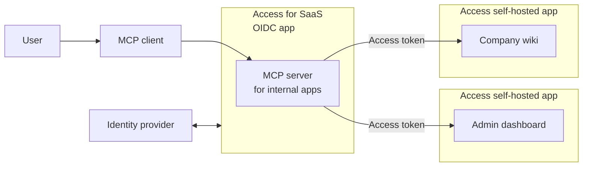

import { Render, GlossaryTooltip, APIRequest } from "~/components";

Cloudflare Access can delegate access from any [self-hosted application](/cloudflare-one/access-controls/applications/http-apps/self-hosted-public-app/) to an [Access for SaaS MCP server](/cloudflare-one/access-controls/ai-controls/saas-mcp/) via [OAuth](https://modelcontextprotocol.io/specification/2025-03-26/basic/authorization). The OAuth access token authorizes the MCP server to make requests to your self-hosted applications on behalf of the user, using the user's specific permissions and scopes.

For example, your organization may wish to deploy an MCP server that helps employees interact with internal applications. You can configure [Access policies](/cloudflare-one/access-controls/policies/#selectors) to ensure that only authorized users can access those applications, either directly or by using an <GlossaryTooltip term="MCP client">MCP client</GlossaryTooltip>.



This guide covers how to use the Cloudflare API to link a self-hosted application to a remote MCP server. The core of this feature is the `linked_app_token` rule type, which allows an Access policy on one application to accept OAuth access tokens generated for another.

## Prerequisites

- A [self-hosted Access application](/cloudflare-one/access-controls/applications/http-apps/self-hosted-public-app/)

## 1. Secure the MCP server with Access for SaaS

The first step is to add the MCP server to Cloudflare Access as an OIDC-based SaaS application. For step-by-step instructions on how to add an MCP server, refer to [Secure MCP servers with Access for SaaS](/cloudflare-one/access-controls/ai-controls/saas-mcp/).

## 2. Get the SaaS application ID

Get the `id` of the MCP server SaaS application:

<APIRequest path="/accounts/{account_id}/access/apps" method="GET" />

```json title="Response"
{
	"id": "3537a672-e4d8-4d89-aab9-26cb622918a1",
	"uid": "3537a672-e4d8-4d89-aab9-26cb622918a1",
	"type": "saas",
	"name": "mcp-server-cf-access",
	...
}
```

## 3. Create an Access policy

1. Create the following Access policy, replacing the `app_uid` value with the `id` of your SaaS application:

   <APIRequest
   	path="/accounts/{account_id}/access/policies"
   	method="POST"
   	json={{
   		name: "Allow MCP server",
   		decision: "non_identity",
   		include: [
   			{
   				linked_app_token: {
   					app_uid: "3537a672-e4d8-4d89-aab9-26cb622918a1",
   				},
   			},
   		],
   	}}
   />

   :::note
   The `linked_app_token` rule type only works with [`non_identity` decisions](/cloudflare-one/access-controls/policies/#service-auth), similar to service token rules.
   :::

2. Copy the Access policy `id` returned in the response:

   ```json title="Response" {5}
   {
   		"created_at": "2025-08-06T20:06:23Z",
   		"decision": "non_identity",
   		"exclude": [],
   		"id": "a38ab4d4-336d-4f49-9e97-eff8550c13fa",
   		"include": [
   			{
   				"linked_app_token": {
   					"app_uid": "6cdc3892-f9f1-4813-a5ce-38c2753e1208"
   				}
   			}
   		],
   		"name": "Allow MCP server",
   		...
   }
   ```

This policy will allow requests if they present a valid OAuth access token that was issued for the specified SaaS application.

## 4. Update the self-hosted application

You can add the `linked_app_token` policy to any `self_hosted` application in your Zero Trust account. Other app types (such as `saas`) are [not currently supported](#known-limitations).

1. Get your existing self-hosted application configuration:

   <APIRequest
   	path="/accounts/{account_id}/access/apps/{app_id}"
   	method="GET"
   />

2. Add the Access policy to the self-hosted application. To avoid overwriting your existing configuration, the `PUT` request body should contain all fields returned by the previous `GET` request.

   <APIRequest
   	path="/accounts/{account_id}/access/apps/{app_id}"
   	method="PUT"
   	json={{
   		policies: ["a38ab4d4-336d-4f49-9e97-eff8550c13fa"],
   	}}
   />

## 5. Configure the MCP server

With the policy in place, every API request to the self-hosted application must now include a valid `access_token` from Cloudflare Access. You will need to configure the MCP server to forward the `access_token` in an HTTP request header:

```txt
Authorization: Bearer ACCESS_TOKEN
```

The end-to-end authorization flow is as follows:

1. The MCP server authenticates against the Access for SaaS app via OAuth.
2. Upon success, the MCP server receives an `access_token`.
3. The MCP server makes an API request to the self-hosted application with the token in the request headers.
4. Cloudflare Access intercepts the request to the self-hosted app, inspects the token, and validates it against the `linked_app_token` rule in the policy.
5. If the token is valid and was issued for the linked SaaS app, the request is allowed. Otherwise, it is blocked.

## Known limitations

The MCP OAuth feature only works with self-hosted applications that rely on the [Cloudflare Access JWT](/cloudflare-one/access-controls/applications/http-apps/authorization-cookie/validating-json/) to authenticate and identify the user. If the application implements its own layer of authentication after Cloudflare Access, then this feature is at best a partial solution. Requests that are successfully authenticated by Access may still be blocked by the application itself, resulting in an HTTP `401` or `403` error.
