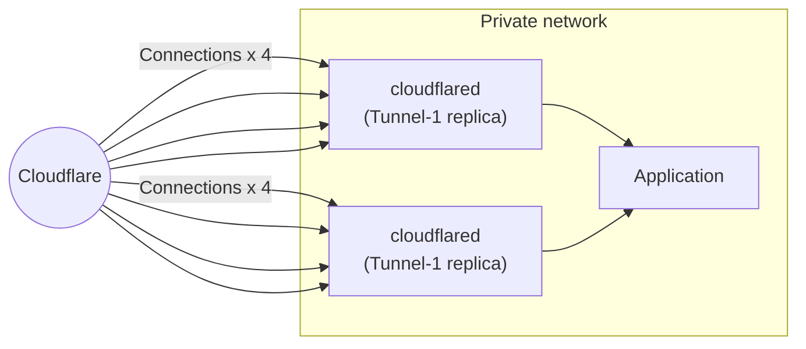
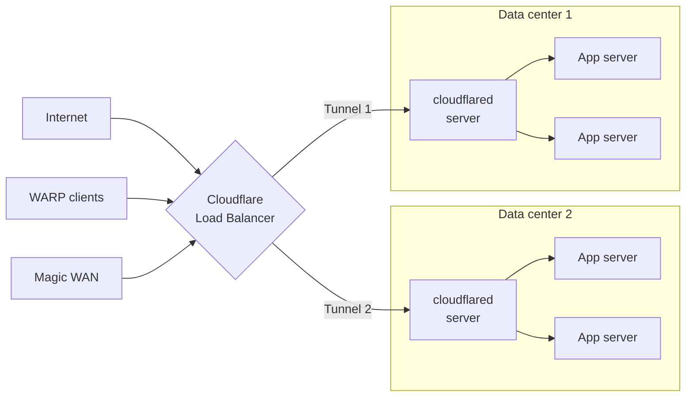

import { Details, GlossaryTooltip } from "~/components";

Our lightweight and open-source connector, [`cloudflared`](https://github.com/cloudflare/cloudflared), was built to be highly available without any additional configuration requirements. When you run a tunnel, `cloudflared` establishes four outbound-only connections between the origin server and the Cloudflare network. These four connections are made to four different servers spread across at least two distinct data centers. This model ensures high availability and mitigates the risk of individual connection failures. This means in event a single connection, server, or data center goes offline, your resources will remain available.

## `cloudflared` replicas

Cloudflare Tunnel allows users to deploy additional instances of our connector, `cloudflared`, for availability and failover scenarios. We refer to these unique instances as replicas. Each replica establishes four new connections which serve as additional points of ingress to your origin, should you need them. Each of the replicas will point to the same tunnel. This ensures that your network remains up in the event a single host running `cloudflared` goes down.

By design, replicas do not offer any level of traffic steering (random, hash, or round-robin). Instead, when a request arrives to Cloudflare, it will be forwarded to the replica that is geographically closest. If that distance calculation is unsuccessful or the connection fails, we will retry others, but there is no guarantee about which connection is chosen.

### When to use `cloudflared` replicas

- To provide additional points of availability for a single tunnel.
- To allocate failover nodes within your network.
- To update the configuration of a tunnel [without downtime](/cloudflare-one/networks/connectors/cloudflare-tunnel/downloads/update-cloudflared/#update-with-multiple-cloudflared-instances).

For setup instructions, refer to [Deploy cloudflared replicas](/cloudflare-one/networks/connectors/cloudflare-tunnel/configure-tunnels/tunnel-availability/deploy-replicas/).

## Cloudflare Load Balancers

[Cloudflare Load Balancing](/load-balancing/) proactively steers traffic away from unhealthy origins and intelligently distributes the traffic load based on your choice of [steering algorithms](/load-balancing/understand-basics/traffic-steering/). Unlike [`cloudflared` replicas](#cloudflared-replicas) which all use the same tunnel, a typical load balancer setup requires creating multiple tunnels. Most customers will create one tunnel per data center and one load balancer pool per tunnel.

### When to use load balancers

- To intelligently steer traffic based on latency, geolocation, or other signals.
- To implement failover logic if a tunnel reaches an inactive state.
- To get a [health alert](/notifications/notification-available/#load-balancing) when a tunnel reaches an inactive state.
- To distribute traffic more evenly across your Cloudflare Tunnel-accessible origins or endpoints.

For setup instructions, refer to [Public load balancers](/cloudflare-one/networks/connectors/cloudflare-tunnel/routing-to-tunnel/public-load-balancers/) or [Private Network Load Balancing](/load-balancing/private-network/) depending on your [use case](#types-of-load-balancers).

### Types of load balancers

There are two types of load balancers that you can use with Cloudflare Tunnel endpoints:

- [Public load balancers](/cloudflare-one/networks/connectors/cloudflare-tunnel/routing-to-tunnel/public-load-balancers/) steer traffic from the Internet to applications published on a Cloudflare domain. Use this method if your service is served by Cloudflare Tunnel via a [published application route](/cloudflare-one/networks/connectors/cloudflare-tunnel/get-started/create-remote-tunnel/#2a-publish-an-application).
- [Private load balancers](/load-balancing/private-network/) steer traffic from WARP clients, Magic WAN, and other <GlossaryTooltip term = "on-ramp">on-ramps</GlossaryTooltip> to an internal IP on your private network. Use this method if your service is connected to Cloudflare Tunnel via a [CIDR route](/cloudflare-one/networks/connectors/cloudflare-tunnel/private-net/cloudflared/connect-cidr/).

:::note
[Private hostname routes](/cloudflare-one/networks/connectors/cloudflare-tunnel/private-net/cloudflared/connect-private-hostname/) are not currently compatible with Load Balancing. If your service is connected via a hostname route, use `cloudflared` [replicas](#cloudflared-replicas) for high availability.
:::