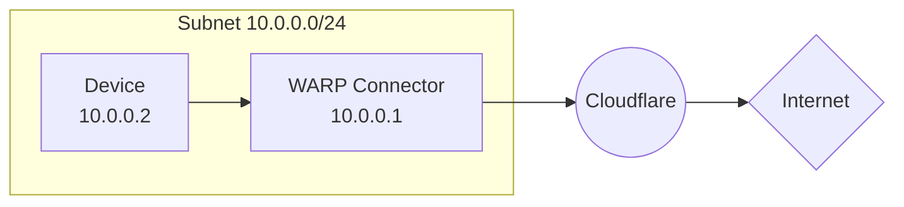
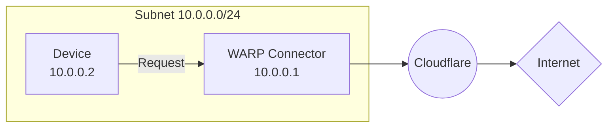

import { Render, Details, GlossaryTooltip, TabItem, Tabs } from "~/components";

This guide covers how to connect a private network to the Internet using WARP Connector. In this example, we will create a WARP Connector for subnet `10.0.0.0/24` and install it on `10.0.0.1`.

## Prerequisites

- A Linux host [^1] on the subnet
- Verify that your firewall allows inbound/outbound traffic over the [WARP IP addresses, ports, and domains](/cloudflare-one/team-and-resources/devices/warp/deployment/firewall/).

## 1. Install a WARP Connector

<Render file="tunnel/warp-connector-install" product="cloudflare-one" />

## 2. (Recommended) Create a device profile

<Render file="tunnel/warp-connector-device-profile" product="cloudflare-one" />

## 3. Route traffic from subnet to WARP Connector

The WARP Connector host will automatically forward DNS and network traffic to Cloudflare. Depending on where you installed the WARP Connector, you may need to configure other devices on the subnet to route outbound requests through WARP Connector.

### Option 1: Default gateway

<Render file="tunnel/warp-connector-default-gateway" product="cloudflare-one" />

### Option 2: Alternate gateway

<Render
	file="tunnel/warp-connector-alternate-gateway"
	product="cloudflare-one"
/>

#### Add IP route to router

For example, for all traffic from the subnet to egress through WARP Connector, add a rule on the router that routes `0.0.0.0` to the WARP Connector host machine (`10.0.0.100`).

<Render
	file="tunnel/warp-connector-alternate-gateway-flow"
	product="cloudflare-one"
/>

#### Configure DNS resolver on router

<Render
	file="tunnel/warp-connector-alternate-gateway-dns"
	product="cloudflare-one"
/>

### Option 3: Intermediate gateway

<Render
	file="tunnel/warp-connector-intermediate-gateway"
	product="cloudflare-one"
/>

#### Add IP route to devices

<Render
	file="tunnel/warp-connector-route-all-traffic"
	product="cloudflare-one"
/>

<Render file="tunnel/warp-connector-verify-routes" product="cloudflare-one" />

#### Configure DNS resolver on devices

<Render
	file="tunnel/warp-connector-intermediate-gateway-dns"
	product="cloudflare-one"
/>

## 4. Test the WARP Connector

You can now test if traffic from your subnet routes through Cloudflare. For example,

1. On the `10.0.0.2` device, run `curl --ipv4 www.google.com`.
2. Check your [Gateway DNS logs](/cloudflare-one/insights/logs/gateway-logs/) for queries from `warp_connector@<your-team-name>.cloudflareaccess.com`. Logs may take a few minutes to populate.

[^1]:
    <Render
    	file="tunnel/warp-connector-linux-packages"
    	product="cloudflare-one"
    />
