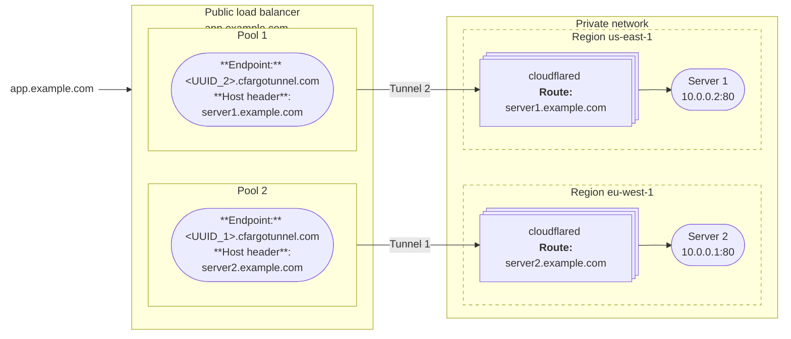
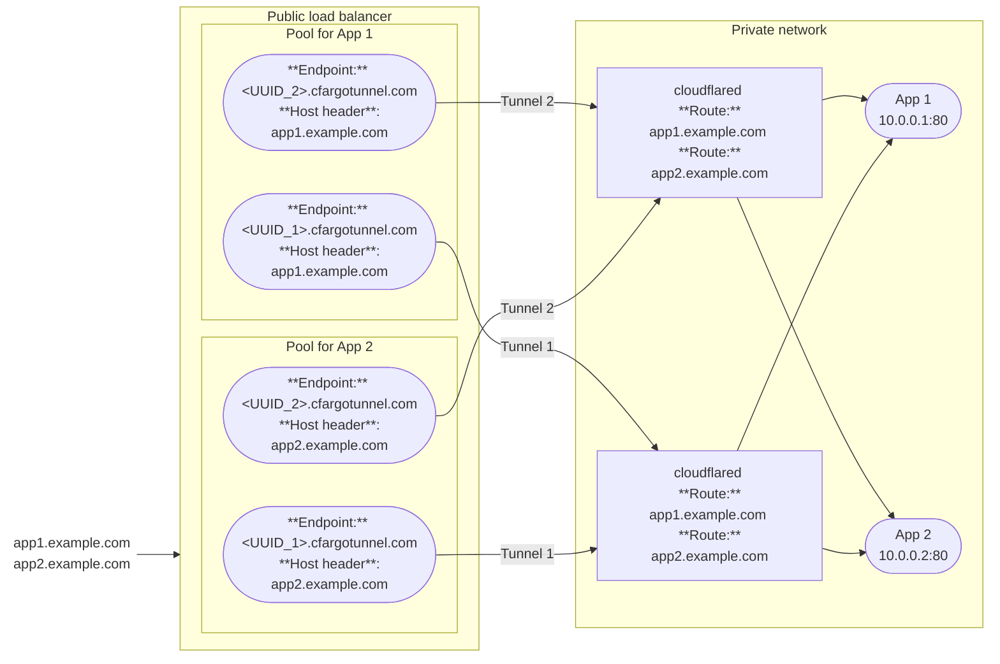

import { Render, DashButton, Details } from "~/components";

A [public load balancer](/load-balancing/load-balancers/) allows you to distribute traffic across the servers that are running your [published applications](/cloudflare-one/networks/connectors/cloudflare-tunnel/routing-to-tunnel/).

When you add a [published application route](/cloudflare-one/networks/connectors/cloudflare-tunnel/get-started/create-remote-tunnel/#2a-publish-an-application) to your Cloudflare Tunnel, Cloudflare generates a subdomain of `cfargotunnel.com` with the UUID of the created tunnel. You can add the application to a load balancer pool by using `<UUID>.cfargotunnel.com` as the [endpoint address](/load-balancing/understand-basics/load-balancing-components/#endpoints) and specifying the application hostname (`app.example.com`) in the [endpoint host header](/load-balancing/additional-options/override-http-host-headers/). Load Balancer does not support directly adding `app.example.com` as an endpoint if the service is behind Cloudflare Tunnel.

## Create a public load balancer

### Prerequisites

- A Cloudflare Tunnel with a [published application route](/cloudflare-one/networks/connectors/cloudflare-tunnel/get-started/create-remote-tunnel/#2a-publish-an-application)

### Create a load balancer

To create a load balancer for Cloudflare Tunnel published applications:

1. In the Cloudflare dashboard, go to the **Load Balancing** page.

	 <DashButton url="/?to=/:account/load-balancing" />
2. Select **Create load balancer**.
3. Select **Public load balancer**.
4. Under **Select website**, select the domain of your published application route.
5. On the **Hostname** page, enter a hostname for the load balancer (for example, `lb.example.com`).
6. On the **Pools** page, select **Create a pool**.
7. Enter a descriptive name for the pool. For example, if you are configuring one pool per tunnel, the pool name can match your tunnel name.
8. To add a tunnel endpoint to the pool, configure the following fields:
			- **Endpoint Name**: Name of the server that is running the application
			- **Endpoint Address**: `<UUID>.cfargotunnel.com`, where `<UUID>` is replaced by your Tunnel ID. You can find the **Tunnel ID** in [Cloudflare One](https://one.dash.cloudflare.com) under **Networks** > **Connectors** > **Cloudflare Tunnels**.
			- **Header value**: Hostname of your published application route (such as `app.example.com`). To find the hostname value, open your Cloudflare Tunnel configuration and go to the **Published application routes** tab.
			- **Weight**: Assign a [weight](/load-balancing/understand-basics/traffic-steering/origin-level-steering/#weights) to the endpoint. If you only have one endpoint, enter `1`.
	:::note
	A single origin pool cannot have the same Tunnel UUID referenced twice.
	:::
9. On the **Pools** page, choose a **Fallback pool**. Refer to [Global traffic steering](/load-balancing/understand-basics/traffic-steering/steering-policies/) for information on how the load balancer routes traffic to pools.
10. (Recommended) On the **Monitors** page, attach a monitor to the tunnel endpoint. For example, if your application is HTTP or HTTPS, you can create an HTTPS monitor to poll the application:
	- **Type**: _HTTPS_
	- **Path**: `/`
	- **Port**: `443`
	- **Expected Code(s)**: `200`
	- **Header Name**: `Host`
	- **Value**: `app.example.com`

	:::note
	TCP monitors are not supported for tunnel endpoints. For a workaround, refer to [Monitors and TCP tunnel origins](#monitors-and-tcp-tunnel-origins).
	:::

11. Save and deploy the load balancer.
12. To test the load balancer, access the application using the load balancer hostname (`lb.example.com`).

Refer to the [Load Balancing documentation](/load-balancing/) for more details on load balancer settings and configurations.

### Optional Cloudflare settings

The application will default to the Cloudflare settings for the load balancer hostname, including [Rules](/rules/), [Cache Rules](/cache/how-to/cache-rules/) and [WAF rules](/waf/). You can change the settings for your hostname in the [Cloudflare dashboard](https://dash.cloudflare.com/).

## Common architectures

Review common load balancing configurations for published applications behind Cloudflare Tunnel.

### One app per load balancer

For this example, assume we have a web application that runs on servers in two different data centers. We want to connect the application to Cloudflare so that users can access the application from anywhere in the world. Additionally, we want Cloudflare to load balance between the servers such that if the primary server fails, the secondary server receives all traffic.

As shown in the diagram, a typical setup includes:
- A dedicated Cloudflare Tunnel per data center.
- One load balancer pool per tunnel. The load balancer hostname is set to the user-facing application hostname (`app.example.com`).
- One load balancer endpoint per pool. The endpoint host header is set to the `cloudflared` published application hostname (`server1.example.com`)
- At least two `cloudflared` [replicas](#session-affinity-and-replicas) per tunnel in their respective data centers, in case a `cloudflared` host machine goes down.

Users can now connect to the application using the load balancer hostname (`app.example.com`). Note that this configuration is only valid for [Active-Passive failover](/load-balancing/load-balancers/common-configurations/#active---passive-failover), since each pool only supports one endpoint per tunnel.

### Multiple apps per load balancer

The following diagram illustrates how to steer traffic to two different applications on a private network using a single load balancer.

This load balancing setup includes:

- Two Cloudflare Tunnels with identical routes to both applications.
- One load balancer pool per application.
- Each load balancer pool has an endpoint per tunnel.
- A [DNS record](#dns-records) for each application that points to the load balancer hostname.

Users can now access all applications through the load balancer. Since there are multiple tunnel endpoints per pool, this configuration supports [Active-Active Failover](/load-balancing/load-balancers/common-configurations/#active---active-failover). Active-Active uses all available endpoints in the pool to process requests simultaneously, providing better performance and scalability by load balancing traffic across them.

#### DNS records

When you configure a published application route via the dashboard, Cloudflare will automatically generate a `CNAME` DNS record that points the application hostname (`app1.example.com`) to the tunnel subdomain (`<UUID>.cfargotunnel.com`). You can [edit these DNS records](/dns/manage-dns-records/how-to/create-dns-records/#edit-dns-records) so that they point to the load balancer hostname instead.

:::note
Tunnel routes configured via the API or CLI require [manually creating DNS records](/cloudflare-one/networks/connectors/cloudflare-tunnel/routing-to-tunnel/dns/).
:::

Here is an example of what your DNS records will look like before and after setting up [Multiple apps per load balancer](#multiple-apps-per-load-balancer):

**Before**:
| Type | Name | Content |
| ---- | ---- | ------- |
| CNAME | app1 | `<UUID_1>.cfargotunnel.com` |
| CNAME | app2 | `<UUID_1>.cfargotunnel.com` |
| CNAME | app1 | `<UUID_2>.cfargotunnel.com` |
| CNAME | app2 | `<UUID_2>.cfargotunnel.com`  |

**After**:
| Type | Name | Content |
| ---- | ---- | ------- |
| LB   | `lb.example.com` | n/a |
| CNAME | app1 | `lb.example.com` |
| CNAME | app2 | `lb.example.com` |

## Known limitations

### Monitors and TCP tunnel origins

If you have a tunnel to a port or SSH port, do not set up a [TCP monitor](/load-balancing/monitors/). Instead, set up a health check endpoint on the `cloudflared` host and create an HTTPS monitor. For example, you can use `cloudflared` to return a fixed HTTP status response:

1. In your Cloudflare Tunnel, [add a published application route](/cloudflare-one/networks/connectors/cloudflare-tunnel/get-started/create-remote-tunnel/#2a-publish-an-application) to represent the health check endpoint:
	- **Hostame**: Enter a hostname for the health check endpoint (for example, `health-check.example.com`)
	- **Service Type**: _HTTP_STATUS_
	- **HTTP Status Code**: `200`
2. From the **Load Balancing** page, [create a monitor](/load-balancing/monitors/create-monitor/) with the following properties:
	- **Type**: _HTTPS_
	- **Path**: `/`
	- **Port**: `443`
	- **Expected Code(s)**: `200`
	- **Header Name**: `Host`
	- **Value**: `health-check.example.com`

You can now assign this monitor to your load balancer endpoint. The monitor will only verify that your server is reachable. It does not check whether the server is running and accepting requests.

### Session affinity and replicas

The load balancer does not distinguish between [replicas](/cloudflare-one/networks/connectors/cloudflare-tunnel/configure-tunnels/tunnel-availability/) of the same tunnel. If you run the same tunnel UUID on two separate hosts, the load balancer treats both hosts as a single endpoint. To maintain [session affinity](/load-balancing/understand-basics/session-affinity/) between a client and a particular host, you will need to connect each host to Cloudflare using a different tunnel UUID.

### Local connection preference

If you notice traffic imbalances across endpoints in different locations, you may have to adjust your load balancer setup.

When an end user sends a request to your application, Cloudflare routes their traffic using [Anycast routing](https://www.cloudflare.com/learning/cdn/glossary/anycast-network/) and their request typically goes to the nearest Cloudflare data center. Cloudflare Tunnel will prefer to serve the request using `cloudflared` connections in the same data center. This behavior can impact how connections are weighted and traffic is distributed.

If you are running [`cloudflared` replicas](/cloudflare-one/networks/connectors/cloudflare-tunnel/configure-tunnels/tunnel-availability/), switch to separate Cloudflare tunnels so that you can have more granular control over [traffic steering](/load-balancing/understand-basics/traffic-steering/).
