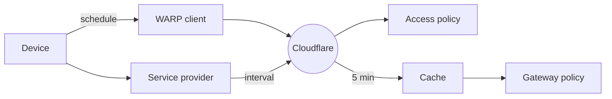

import { Render } from "~/components";

With Cloudflare Zero Trust, you can configure Zero Trust policies that rely on additional signals from the WARP client or from third-party endpoint security providers. When device posture checks are configured, users can only connect to a protected application or network resource if they have a managed or healthy device.

## 1. Enable device posture checks

Setup instructions and requirements vary depending on the device posture attribute. Refer to the links below to view the setup guide for your provider.

- [WARP client checks](/cloudflare-one/reusable-components/posture-checks/warp-client-checks/) are performed by the Cloudflare WARP client.
- [Service-to-service checks](/cloudflare-one/integrations/service-providers/) are performed by third-party device posture providers.
- [Access integration checks](/cloudflare-one/reusable-components/posture-checks/access-integrations/) are only configurable for Access applications. These attributes cannot be used in Gateway policies.

## 2. Verify device posture checks

Before integrating a device posture check in a Gateway or Access policy, verify that the Pass/Fail results match your expectations. To view the latest test results for a specific device:

1. In [Cloudflare One](https://one.dash.cloudflare.com/), go to **Team & Resources** > **Devices**.
2. Select the device.
3. Select **View details**.
4. Select the **Posture checks** tab.

## 3. Build a device posture policy

You can now use your device posture check in an [Access policy](/cloudflare-one/access-controls/policies/) or a Gateway [network](/cloudflare-one/traffic-policies/network-policies/common-policies/#enforce-device-posture) or [HTTP](/cloudflare-one/traffic-policies/http-policies/common-policies/#check-device-posture) policy. In Access, the enabled device posture attributes will appear in the list of available [selectors](/cloudflare-one/access-controls/policies/#selectors). In Gateway, the attributes will appear when you choose the [Passed Device Posture Check](/cloudflare-one/traffic-policies/network-policies/#device-posture) selector.

:::caution[Gateway policy limitation]

Gateway does not support device posture checks for the [Tanium Access integration](/cloudflare-one/reusable-components/posture-checks/warp-client-checks/tanium/).
:::

## 4. Ensure traffic is going through WARP

[WARP client](/cloudflare-one/reusable-components/posture-checks/warp-client-checks/) and [service-to-service](/cloudflare-one/integrations/service-providers/) posture checks rely on traffic going through WARP to detect posture information for a device. In your [Split Tunnel configuration](/cloudflare-one/team-and-resources/devices/warp/configure-warp/route-traffic/split-tunnels/), ensure that the following domains are included in WARP:

- The IdP used to authenticate to Cloudflare Zero Trust if posture check is part of an Access policy.
- `<your-team-name>.cloudflareaccess.com` if posture check is part of an Access policy.
- The application protected by the Access or Gateway policy.

## Policy enforcement rate

Access detects changes in device posture at the same rate as the [polling frequency](#polling-frequency) configured for the posture check.

Because Gateway evaluates network and HTTP policies on every request, it maintains a local cache of posture results that is only updated every five minutes. Therefore, Gateway policies are subject to an additional five-minute delay. For example, if you set your polling frequency to 10 minutes, it may take up to 15 minutes for Gateway to detect posture changes on a device.

:::caution

Gateway does not terminate an [active session](/cloudflare-one/team-and-resources/devices/warp/configure-warp/warp-sessions/#configure-warp-sessions-in-gateway) even if a subsequent posture check fails during that session. Gateway only evaluates posture checks at the beginning of a session, and ongoing sessions will remain uninterrupted.

For example, if you establish an SSH session based on a successful posture check, but a posture requirement fails after the session has started, the session will remain active.

:::

### Expiration

By default, the posture result on Cloudflare remains valid until it is overwritten by new data. You can specify an `expiration` time using our [API](/api/resources/zero_trust/subresources/devices/subresources/posture/methods/update/). We recommend setting the expiration to be longer than the [polling frequency](#polling-frequency).

### Polling frequency

#### WARP client checks

By default, the WARP client polls the device for status changes every five minutes. To modify the polling frequency, use the API to update the [`schedule`](/api/resources/zero_trust/subresources/devices/subresources/posture/methods/update/) parameter.

#### Service provider checks

When setting up a [service-to-service integration](/cloudflare-one/integrations/service-providers/), you will choose a polling frequency to determine how often Cloudflare will query the third-party API. To set the polling frequency via the API, use the [`interval`](/api/resources/zero_trust/subresources/devices/subresources/posture/subresources/integrations/methods/edit/) parameter.
