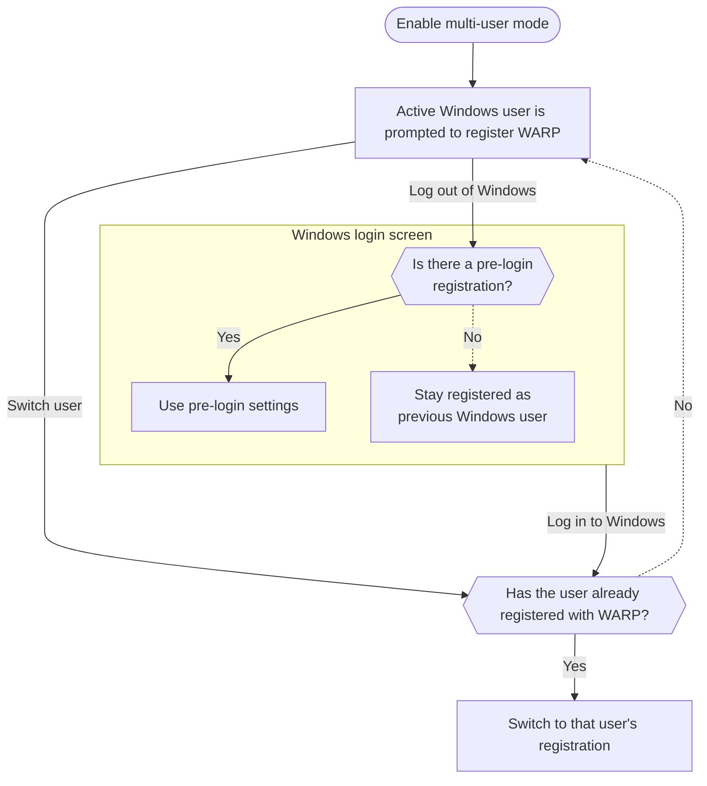

import { Details, Render } from "~/components";

<Details header="Feature availability">

| [WARP modes](/cloudflare-one/team-and-resources/devices/warp/configure-warp/warp-modes/) | [Zero Trust plans](https://www.cloudflare.com/teams-pricing/) |
| ----------------------------------------------------------------------------------------- | ------------------------------------------------------------- |
| All modes                                                                                 | All plans                                                     |

| System   | Availability | Minimum WARP version |
| -------- | ------------ | -------------------- |
| Windows  | ✅           |  2025.6.1400.0       |
| macOS    | ❌           |                      |
| Linux    | ❌           |                      |
| iOS      | ❌           |                      |
| Android  | ❌           |                      |
| ChromeOS | ❌           |                      |

</Details>

Cloudflare WARP supports multiple user registrations on a single Windows device. When deployed in multi-user mode, the WARP client will automatically switch user registrations after a user logs in to their Windows account. All traffic to Cloudflare will be attributed to the currently active Windows user. This allows administrators to apply identity-based policies and device settings, audit user activity, and remove individual users from a shared workstation.

:::caution[DNS logging]
If a user enables **Log DNS queries** in the WARP GUI (or runs `warp-cli dns log enable`), WARP will store all DNS queries on the device onto disk. Any user on the device will be able to examine the DNS queries of another user.
:::

## Enable multi-user mode

To enable multi-user support on Windows, [deploy an MDM file](/cloudflare-one/team-and-resources/devices/warp/deployment/mdm-deployment/#windows) onto the device with the `multi_user` key set to `true`. For example:

```xml
<dict>
  <key>multi_user</key>
  <true/>
  <key>configs</key>
  <array>
    <dict>
      <key>organization</key>
      <string>your-team-name</string>
      <key>display_name</key>
      <string>Default</string>
    </dict>
  </array>
</dict>
```

To use multi-user mode alongside the [Windows pre-login](/cloudflare-one/team-and-resources/devices/warp/deployment/mdm-deployment/windows-prelogin/) and [Switch between Zero Trust organizations](/cloudflare-one/team-and-resources/devices/warp/deployment/mdm-deployment/switch-organizations/) options:

```xml
<dict>
  <key>multi_user</key>
	<true/>
  <key>pre_login</key>
  <dict>
    <key>organization</key>
    <string>mycompany</string>
    <key>auth_client_id</key>
    <string>88bf3b6d86161464f6509f7219099e57.access</string>
    <key>auth_client_secret</key>
    <string>bdd31cbc4dec990953e39163fbbb194c93313ca9f0a6e420346af9d326b1d2a5</string>
  </dict>
  <key>configs</key>
  <array>
		<dict>
			<key>organization</key>
			<string>mycompany</string>
			<key>display_name</key>
			<string>Production environment</string>
  	</dict>
		<dict>
			<key>organization</key>
			<string>test-org</string>
			<key>display_name</key>
			<string>Test environment</string>
		</dict>
  </array>
</dict>
```

When enabling multi-user mode for the first time, users will need to re-register even if they had a previous registration.

## WARP registration logic

The following flowchart shows how WARP registration settings take effect as users log in and out:



### Fast user switching

:::note
Requires [multi-user mode](#enable-multi-user-mode).
:::

[Fast user switching](https://learn.microsoft.com/windows/win32/shell/fast-user-switching) is a Windows feature that allows users to switch accounts without logging out. With fast user switching, multiple users may be logged in to the device and generating network traffic. The WARP client will attribute all traffic to the user who has the [interactive windows station](http://techcommunity.microsoft.com/blog/askperf/sessions-desktops-and-windows-stations/372473). For example, if user A is logged in and fast user switches to user B, traffic from both accounts will appear to come from user B. This is because user B is now actively using the Windows desktop GUI. Now assume that user B logs out and there is no [pre-login registration](/cloudflare-one/team-and-resources/devices/warp/deployment/mdm-deployment/windows-prelogin/); WARP will continue to attribute traffic to user B until user A logs back in to the Windows desktop.

To accurately attribute network traffic to specific users, Cloudflare recommends disabling fast user switching or at the very least configuring a [pre-login registration](/cloudflare-one/team-and-resources/devices/warp/deployment/mdm-deployment/windows-prelogin/).

