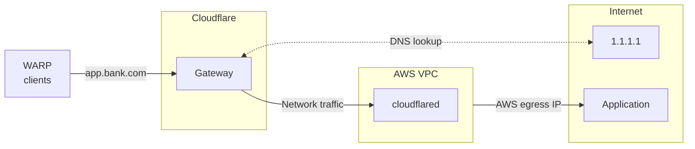

import { Render, Details, GlossaryTooltip } from "~/components";

<Render
	file="gateway/egress-selector-warp-version"
	product="cloudflare-one"
/>

Cloudflare Tunnel can be used for source IP anchoring when you want to use existing egress IPs instead of purchasing [Cloudflare dedicated egress IPs](/cloudflare-one/traffic-policies/egress-policies/dedicated-egress-ips/). Some third-party websites may have an Access Control List (ACL) that only allow connections from certain source IPs. If you already a non-Cloudflare IP on their allowlist (such an egress IP provided by an ISP or a cloud provider like AWS), you can configure `cloudflared` to anchor user traffic to the same IPs that you use today.

For example, assume that your organization's banking service, `app.bank.com`, expects user traffic to come from an AWS IP. You can install `cloudflared` in your AWS environment and add a public hostname route pointing to `app.bank.com`. When users connect to `app.bank.com` using the WARP client, Gateway will apply your network policies and route the filtered traffic down the corresponding Cloudflare Tunnel to AWS. The traffic can then egress to the public Internet using your AWS egress IP.

To learn more about how Gateway applies hostname-based egress policies, refer to the [Cloudflare blog](https://blog.cloudflare.com/egress-policies-by-hostname/).

## Prerequisites

User traffic is on-ramped to Gateway using one of the following methods:

<Render
	file="gateway/egress-selector-onramps"
	product="cloudflare-one"
/>

## 1. Connect your private network

[Connect your private network](/cloudflare-one/networks/connectors/cloudflare-tunnel/private-net/cloudflared/connect-cidr/) to Cloudflare using `cloudflared`. For example, if you want traffic to egress from AWS, connect the private CIDR block of your AWS VPC.

::::note
Requires `cloudflared` version 2025.7.0 or later.
::::

## 2. Add a public hostname route

To route a public hostname through Cloudflare Tunnel:

1. In [Cloudflare One](https://one.dash.cloudflare.com), go to **Networks** > **Routes** > **Hostname routes**.

2. Select **Create hostname route**.

3. In **Hostname**, enter the public hostname that represents the application (for example, `app.bank.com`). The hostname should be accessible from the public Internet.

4. For **Tunnel**, select the Cloudflare Tunnel that is being used to connect the private network to Cloudflare.

5. Select **Create route**.

## 3. Route network traffic through WARP

In your WARP [Split Tunnels](/cloudflare-one/team-and-resources/devices/warp/configure-warp/route-traffic/split-tunnels/) configuration, route the following IP addresses through the WARP tunnel to Gateway.

### Initial resolved IPs

When users connect to a public hostname route, Gateway will assign an <GlossaryTooltip term="initial resolved IP">initial resolved IP</GlossaryTooltip> to the DNS query from the following range:

The initial resolved IP is required because Gateway's network engine operates at L3/L4 and can only see IPs (not hostnames) when processing the connection. If a packet's destination IP falls within the initial resolved IP CGNAT range, Gateway knows that the IP maps to a public hostname route and sends the traffic down the corresponding Cloudflare Tunnel.

To route initial resolved IPs through WARP:

<Render
	file="gateway/egress-selector-split-tunnels"
	product="cloudflare-one"
/>

### Private network IPs

Your private network's CIDR block should also route through the WARP tunnel. For a detailed configuration example, refer to [Connect a private network](/cloudflare-one/networks/connectors/cloudflare-tunnel/private-net/cloudflared/connect-cidr/#3-route-private-network-ips-through-warp).

## 4. (Optional) Configure network policies

You can build [Gateway network policies](/cloudflare-one/traffic-policies/network-policies/) to filter HTTPS traffic to your public hostname on port `443`. For example, suppose that you want to block all WARP users from accessing `app.bank.com` except for a specific set of users or groups. Additionally, those authorized users should only access `app.bank.com` using your AWS egress IP. You can accomplish this using two policies: the first allows specific users to reach `app.bank.com`, and the second blocks all other port `443` traffic to `app.bank.com`.

1. Allow company employees:
	<Render file="gateway/policies/restrict-access-to-private-networks-allow" product="cloudflare-one" params={{ selector: "SNI", value: "app.bank.com" }} />

2. Block everyone else on port `443`:

	| Selector       | Operator | Value        | Action |
	| -------------- | -------- | ------------ | ------ |
	| SNI            | in       | `app.bank.com` | Block  |

Gateway does not currently support hostname-based filtering for traffic on non-`443` ports. To block traffic to `app.bank.com` on all ports, you will need to use the [Destination IP](/cloudflare-one/traffic-policies/network-policies/#destination-ip) selector and specify the public IP space of `app.bank.com`.

## 5. Test the connection

From a WARP device, open a browser and go to `app.bank.com`.

You can search for `app.bank.com` in your [Gateway DNS logs](/cloudflare-one/insights/logs/gateway-logs/); the **DNS response details** section should show the public resolved IPs as well as an <GlossaryTooltip term="initial resolved IP">initial resolved IP</GlossaryTooltip>. You can also check your [Cloudflare Tunnel logs](/cloudflare-one/networks/connectors/cloudflare-tunnel/monitor-tunnels/logs/) to confirm that requests are routing through the tunnel to the public resolved IPs.