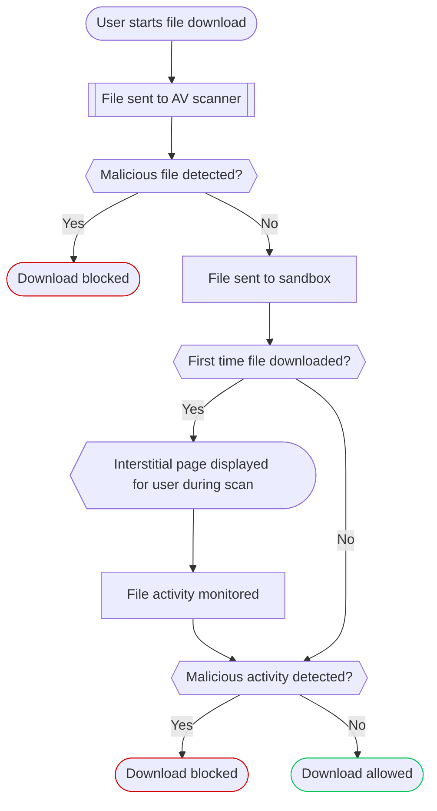

import { Render, Details } from "~/components";

:::note
Available as an add-on to Zero Trust Enterprise plans. For more information, contact your account team.
:::

In addition to [anti-virus (AV) scanning](/cloudflare-one/traffic-policies/http-policies/antivirus-scanning/), Gateway can quarantine previously unseen files downloaded by your users into a sandbox and scan them for malware.

If AV scanning does not detect malware in a file download, Gateway will quarantine the file in the [sandbox](#sandbox-environment). If the file has not been downloaded before, Gateway will monitor any actions taken by the file and compare them to known malware patterns. During this process, Gateway will display an interstitial page in the user's browser. If the sandbox does not detect malicious activity, Gateway will release the file from quarantine and download it to your user's device. If the sandbox detects malicious activity, Gateway will block the download. For any subsequent downloads of the file, Gateway will remember and apply its allow/block decision.

Gateway will log any file sandbox decisions in your [HTTP logs](/cloudflare-one/insights/logs/gateway-logs/#http-logs).

## Get started

To begin quarantining downloaded files, turn on file sandboxing:

1. In [Zero Trust](https://one.dash.cloudflare.com), go to **Traffic policies** > **Traffic settings**.
2. Turn on **File sandboxing**.
3. (Optional) To block requests containing [non-scannable files](#non-scannable-files), select **Block requests for files that cannot be scanned**.

You can now create [Quarantine HTTP policies](/cloudflare-one/traffic-policies/http-policies/#quarantine) to determine what files to scan in the sandbox.

## Create test policy

To test if file sandboxing is working, you can create a Quarantine policy that matches the [Cloudflare Sandbox Test](https://sandbox.cloudflaredemos.com/):

1. In [Cloudflare One](https://one.dash.cloudflare.com/), go to **Traffic policies** > **Firewall policies**, then select **HTTP**.
2. Select **Add a policy**.
3. Add the following expression:

   | Selector | Operator | Value                         | Action     |
   | -------- | -------- | ----------------------------- | ---------- |
   | Host     | is       | `sandbox.cloudflaredemos.com` | Quarantine |

4. In **Sandbox file types**, select _ZIP Archive (zip)_.
5. From a device [connected to your Zero Trust organization](/cloudflare-one/team-and-resources/devices/), open a browser and go to the [Cloudflare Sandbox Test](https://sandbox.cloudflaredemos.com/).
6. Select **Download Test File**.

Gateway will quarantine and scan the file, display an interstitial status page in the browser, then release the file for download.

## Sandbox environment

Gateway executes quarantined files in a sandboxed Windows operating system environment. Using machine learning, the sandbox compares how files of a certain type behave compared to how these files should behave. The sandbox detects file actions down to the kernel level and compare these a real-time malware database. In addition, Gateway checks the sandbox's network activity for malicious behavior and data exfiltration.

## Compatibility

### Supported file types

<Render file="gateway/sandbox-file-types" product="cloudflare-one" />

### Non-scannable files

Gateway cannot scan requests containing the following files:

- Files larger than 100 MB
- PGP encrypted files
