import {
	GlossaryDefinition,
	GlossaryTooltip,
	Render,
	TabItem,
	Tabs,
	Badge,
} from "~/components";

Cloudflare Gateway can perform [SSL/TLS decryption](https://www.cloudflare.com/learning/security/what-is-https-inspection/) in order to inspect HTTPS traffic for malware and other security risks.

When you turn on TLS decryption, Gateway will decrypt all traffic sent over HTTPS, apply your HTTP policies, and then re-encrypt the request with a [user-side certificate](/cloudflare-one/team-and-resources/devices/user-side-certificates/).

Cloudflare prevents traffic interference by decrypting, inspecting, and re-encrypting HTTPS requests in its data centers in memory only. Gateway only stores eligible cache content at rest. All cache disks are encrypted at rest. You can configure where TLS decryption takes place with [Regional Services](/data-localization/regional-services/) in the [Cloudflare Data Localization Suite (DLS)](/data-localization/). To further control what data centers traffic egresses from, you can use [dedicated egress IPs](/cloudflare-one/traffic-policies/egress-policies/dedicated-egress-ips/).

Cloudflare supports connections from users to Gateway over TLS 1.1, 1.2, and 1.3.

## Turn on TLS decryption

:::note[Prerequisite]
Before you turn on TLS decryption, ensure you have installed either a [Cloudflare-generated certificate](/cloudflare-one/team-and-resources/devices/user-side-certificates/) or [custom certificate](/cloudflare-one/team-and-resources/devices/user-side-certificates/custom-certificate/) on your users' devices.
:::

To turn on TLS decryption:

<Render file="gateway/enable-tls-decryption" product="cloudflare-one" />

## Inspection limitations

Gateway does not support TLS decryption for applications which use:

- [Certificate pinning](#incompatible-certificates)
- [Self-signed certificates](#incompatible-certificates)
- [Mutual TLS (mTLS) authentication](#incompatible-certificates)
- [ESNI and ECH handshake encryption](#esni-and-ech)
- [Automatic HTTPS upgrades](#google-chrome-automatic-https-upgrades)

### Inspect on all ports <Badge text="Beta" variant="caution" size="small" />

<Render
	file="gateway/inspect-on-all-ports"
	product="cloudflare-one"
	params={{
		turnOnProcedure:
			"you can turn on [protocol detection](/cloudflare-one/traffic-policies/network-policies/protocol-detection/) and configure Gateway to [inspect traffic on all ports](/cloudflare-one/traffic-policies/network-policies/protocol-detection/#inspect-on-all-ports)",
	}}
/>

### Incompatible certificates

Applications that use certificate pinning and mTLS authentication do not trust Cloudflare certificates. For example, most mobile applications use <GlossaryTooltip term="certificate pinning" link="/ssl/reference/certificate-pinning/">certificate pinning</GlossaryTooltip>. Cloudflare does not trust applications that use self-signed certificates instead of certificates signed by a public CA.

If you try to perform TLS decryption on an application with an incompatible certificate configuration, the application may return an SSL or trust error and/or fail to load. To resolve this issue, you can:

- Add a [Cloudflare certificate](/cloudflare-one/team-and-resources/devices/user-side-certificates/manual-deployment/#add-the-certificate-to-applications) to supported applications.
- Create a [Do Not Inspect policy](/cloudflare-one/traffic-policies/http-policies/#do-not-inspect) to exempt applications from inspection. The [Application selector](/cloudflare-one/traffic-policies/http-policies/#application) provides a list of trusted applications that are known to use embedded certificates. Note that if you create a Do Not Inspect policy for an application or website, you will lose the ability to log or block HTTP requests, apply DLP policies, and perform AV scanning.
- Configure a [Split Tunnel](/cloudflare-one/team-and-resources/devices/warp/configure-warp/route-traffic/split-tunnels/) in Include mode to ensure Gateway will only inspect traffic destined for your IPs or domains. This is useful for organizations that deploy Zero Trust on users' personal devices or otherwise expect personal applications to be used.

Alternatively, to allow HTTP filtering while accessing a site with an insecure certificate, set your [Untrusted certificate action](/cloudflare-one/traffic-policies/http-policies/#untrusted-certificates) to _Pass through_.

### Google Chrome automatic HTTPS upgrades

Google Chrome can automatically upgrade HTTP requests to HTTPS requests, even when you select a link that explicitly declares `http://`. When you use Gateway to proxy and filter your traffic, this upgrade can interrupt the connection between your Zero Trust users and Gateway.

You can turn off automatic HTTPS upgrades via a Gateway pass through policy, a Chrome browser flag, or a Chrome Enterprise policy.

<Tabs> <TabItem label="Pass through policy">

To disable automatic HTTPS upgrades for a URL across your Zero Trust organization, create a Gateway pass through policy.

1. Deploy a [custom root certificate](/cloudflare-one/team-and-resources/devices/user-side-certificates/custom-certificate/).

2. Create an [HTTP policy](/cloudflare-one/traffic-policies/http-policies/) to match the domain of the URL being automatically upgraded. For example:

   | Selector | Operator | Value         | Action |
   | -------- | -------- | ------------- | ------ |
   | URL      | in       | `example.com` | Allow  |

3. In **Untrusted certificate action**, choose _Pass through_.

4. Select **Create policy**.

The pass through policy will bypass insecure connection upgrades for any device connected to your Zero Trust organization. For more information, refer to [Untrusted certificates](/cloudflare-one/traffic-policies/http-policies/#untrusted-certificates).

</TabItem> <TabItem label="Chrome browser flag">

To disable automatic HTTPS upgrades on a per-browser basis, go to [Chrome flags](chrome://flags/#https-upgrades) and turn off **HTTPS Upgrades**.

</TabItem> <TabItem label="Chrome enterprise policy">

Chrome Enterprise users can turn off automatic HTTPS upgrades for all URLs with a [`HttpsUpgradesEnabled` management policy](https://chromeenterprise.google/policies/#HttpsUpgradesEnabled).

</TabItem> </Tabs>

### Mutual TLS (mTLS)

When decrypting TLS to inspect traffic, connections that use mutual TLS (mTLS) will fail because Gateway cannot return the necessary client certificate. To prevent connection failures, create a [Do Not Inspect policy](/cloudflare-one/traffic-policies/http-policies/#do-not-inspect) for this traffic.

### ESNI and ECH

Websites that adhere to [ESNI or Encrypted Client Hello (ECH) standards](https://blog.cloudflare.com/encrypted-client-hello/) encrypt the Server Name Indicator (SNI) during the TLS handshake and are therefore incompatible with HTTP inspection. This is because Gateway relies on the SNI to match an HTTP request to a policy. If the ECH fails, browsers will retry the TLS handshake using the unencrypted SNI from the initial request. To avoid this behavior, you can disable ECH in your users' browsers.

You can still apply all [network policy filters](/cloudflare-one/traffic-policies/network-policies/#selectors) except for SNI and SNI Domain. To restrict ESNI and ECH traffic, an option is to filter out all port `80` and `443` traffic that does not include an SNI header.

## Post-quantum support

Gateway supports post-quantum cryptography using a hybrid key exchange with X25519 and MLKEM768 over TLS 1.3. Once the key exchange is complete, Gateway uses AES-128-GCM to encrypt traffic.

Refer to [Post-quantum cryptography](/ssl/post-quantum-cryptography/) to learn more.

## FIPS compliance

By default, TLS decryption can use both TLS version 1.2 and 1.3. However, some environments such as FedRAMP may require cipher suites and TLS versions compliant with FIPS 140-2. FIPS compliance currently requires TLS version 1.2.

### Enable FIPS compliance

<Render file="gateway/enable-tls-decryption" product="cloudflare-one" />

3. Select **Enable only cipher suites and TLS versions compliant with FIPS 140-2**.

### Limitations

When FIPS compliance is enabled, Gateway will only choose [FIPS-compliant cipher suites](#cipher-suites) when connecting to the origin. If the origin does not support FIPS-compliant ciphers, the request will fail.

FIPS-compliant traffic defaults to [HTTP/3](/cloudflare-one/traffic-policies/http-policies/http3/). To enforce HTTP policies for UDP traffic, you must turn on the [Gateway proxy for UDP](/cloudflare-one/traffic-policies/http-policies/http3/#enable-http3-inspection).

## FedRAMP compliance

When you use [Cloudflare Regional Services](/data-localization/regional-services/) in the United States and the WARP client to on-ramp TLS traffic to Gateway, traffic will egress from a Cloudflare data center within Cloudflare's FedRAMP boundary. If a user's closest data center is non-FedRAMP compliant, their traffic will still egress from a FedRAMP compliant data center, maintaining FedRAMP compliance for the traffic.

```mermaid
flowchart LR
 %% Accessibility
 accTitle: How Gateway routes FedRAMP compliant traffic with Regional Services
 accDescr: Flowchart describing how WARP with Gateway routes traffic to egress from a FedRAMP compliant data center when used with Regional Services in the United States.

 %% Flowchart
 subgraph s1["Non-FedRAMP data center"]
        n2["WARP TLS encryption terminated"]
  end
 subgraph s2["FedRAMP data center"]
        n3["Gateway TLS encryption (FIPS) terminated"]
  end
 subgraph s3["Private internal network"]
        n5["FedRAMP compliant cloudflared"]
        n6(["Private server"])
  end
    n1(["User near non-FedRAMP compliant data center"]) -- Gateway TLS connection wrapped with WARP TLS (MASQUE) --> n2
    n2 -- Gateway TLS connection --> n3
    n3 <-- FIPS tunnel --> n5
    n5 --> n6

    n5@{ shape: rect}
```

## Cipher suites

<GlossaryDefinition term="cipher suite" prepend="A cipher suite is " />

The following table lists the default cipher suites Gateway uses for TLS decryption.

| Name (OpenSSL)                | Name (IANA)                             | FIPS-compliant |
| ----------------------------- | --------------------------------------- | -------------- |
| ECDHE-ECDSA-AES128-GCM-SHA256 | TLS_ECDHE_ECDSA_WITH_AES_128_GCM_SHA256 | ✅             |
| ECDHE-ECDSA-AES256-GCM-SHA384 | TLS_ECDHE_ECDSA_WITH_AES_256_GCM_SHA384 | ✅             |
| ECDHE-RSA-AES128-GCM-SHA256   | TLS_ECDHE_RSA_WITH_AES_128_GCM_SHA256   | ✅             |
| ECDHE-RSA-AES256-GCM-SHA384   | TLS_ECDHE_RSA_WITH_AES_256_GCM_SHA384   | ✅             |
| ECDHE-RSA-AES128-SHA          | TLS_ECDHE_RSA_WITH_AES_128_CBC_SHA256   | ❌             |
| ECDHE-RSA-AES256-SHA384       | TLS_ECDHE_RSA_WITH_AES_256_CBC_SHA384   | ✅             |
| AES128-GCM-SHA256             | TLS_RSA_WITH_AES_128_GCM_SHA256         | ✅             |
| AES256-GCM-SHA384             | TLS_RSA_WITH_AES_256_GCM_SHA384         | ✅             |
| AES128-SHA                    | TLS_RSA_WITH_AES_128_CBC_SHA            | ❌             |
| AES256-SHA                    | TLS_RSA_WITH_AES_256_CBC_SHA            | ❌             |

For more information on cipher suites, refer to [Cipher suites](/ssl/edge-certificates/additional-options/cipher-suites/).
