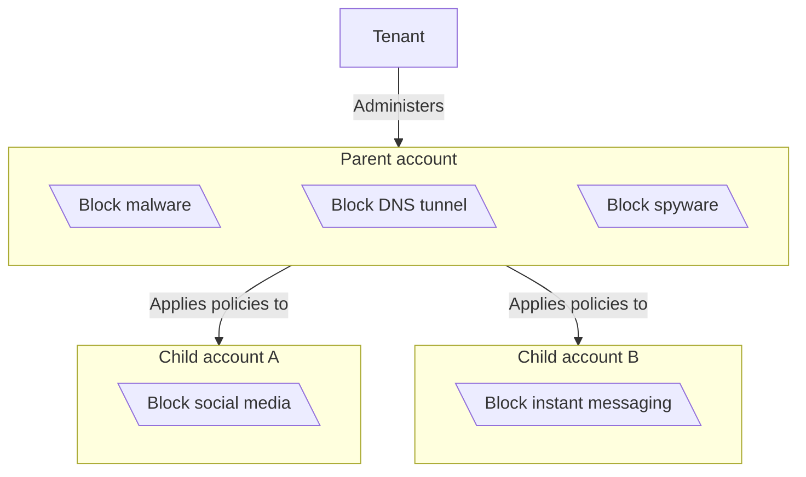
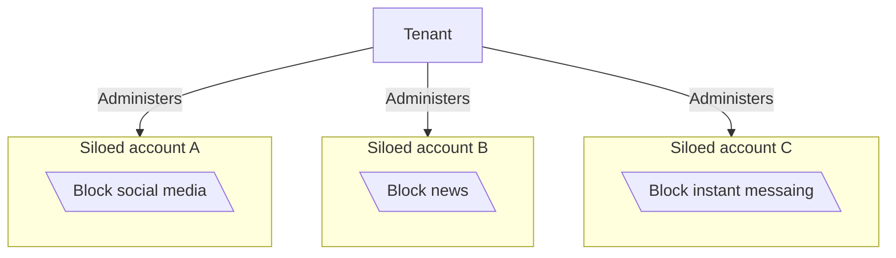

:::note
Only available on Enterprise plans. For more information, contact your account team.
:::

Gateway supports the [Cloudflare Tenant API](/tenant/), which allows Cloudflare-partnered managed service providers (MSPs) to set up and manage Cloudflare accounts and services for their customers. With the Tenant API, MSPs can create Zero Trust deployments with global Gateway policy control. Policies can be customized or overridden at a group or individual account level.

The Tenant platform only supports [DNS policies](/cloudflare-one/traffic-policies/dns-policies/). For more information, refer to the [Cloudflare Zero Trust for managed service providers](https://blog.cloudflare.com/gateway-managed-service-provider/) blog post.

## Get started

{/* Don't need to surface much of the policy creation flow here */}

To set up the Tenant API, refer to [Get started](/tenant/get-started/). Once you have provisioned and configured your customer's Cloudflare accounts, you can create [DNS policies](/cloudflare-one/traffic-policies/dns-policies/).

## Account types

The Gateway Tenant platform supports tiered and siloed account configurations.

### Tiered accounts

In a tiered account configuration, a top-level parent account enforces global security policies that apply to all of its child accounts. Child accounts can override or add policies as needed while still being managed by the parent account. MSPs can also configure child accounts independently from the parent account, including:

- Configuring a [custom block page](/cloudflare-one/reusable-components/custom-pages/gateway-block-page/)
- Generating or uploading [root certificates](/cloudflare-one/team-and-resources/devices/user-side-certificates/)
- Mapping [DNS locations](/cloudflare-one/team-and-resources/devices/agentless/dns/locations/)
- Creating [lists](/cloudflare-one/reusable-components/lists/)

Each child account is subject to the default Zero Trust [account limits](/cloudflare-one/account-limits/).

Gateway evaluates parent account policies before any child account policies. To allow a child account to override a specific parent account policy, you can use the [Update a Zero Trust Gateway rule](/api/resources/zero_trust/subresources/gateway/subresources/rules/methods/update/) endpoint to set the policy's `allow_child_bypass` rule setting to `true`.

### Siloed accounts

In a siloed account configuration, each account operates independently within the same tenant. MSPs manage each account's own security policies, resources, and configurations separately.

