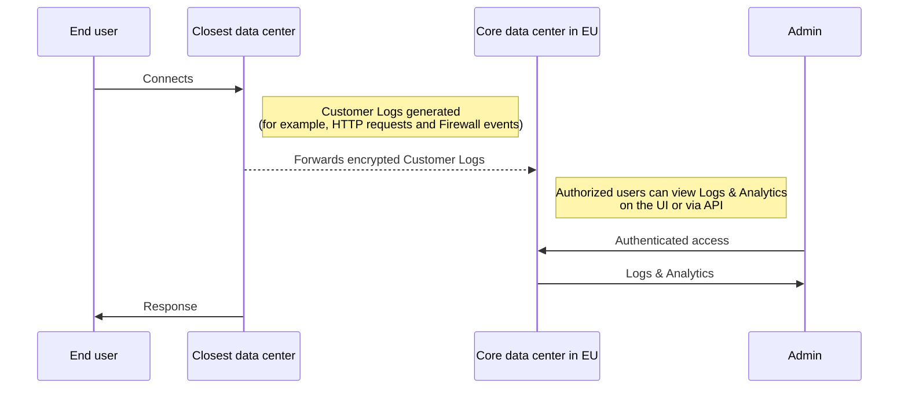

As part of the Data Localization Suite, the Customer Metadata Boundary (CMB) ensures that Customer Logs — any traffic metadata that can identify a customer’s end user (that is, contains the customer's [Account ID](/fundamentals/account/find-account-and-zone-ids/)) — will stay in the `EU` (European Union) or in the `US` (United States), depending on the region the customer selects. For example, if a customer selects the `EU` Customer Metadata Boundary, metadata will **only** be sent to our core data center located in the European Union.

An exception is made if "Allow out-of-region access" is enabled. When enabled, Customer Logs will still be stored in the configured regions but will be accessible to authorized end users, regardless of physical location. Refer to [Out of region access](/data-localization/metadata-boundary/out-of-region-access/) for more details.

## Customer traffic metadata flow

The following diagram is a high-level example of the flow of how metadata about a customer's traffic is generated on a Cloudflare data center. Logs are exclusively sent to the EU core data center for Cloudflare customers and their authorized users to access and view.

 

 

## Log management

Additionally, customers have the option to configure [Logpush](/logs/logpush/) to push their Customer Logs to various storage services, SIEMs, and log management providers.

## Product specific-behavior

For detailed information about product-specific behavior regarding Metadata Boundary, refer to the [Cloudflare product compatibility](/data-localization/compatibility/) page.
