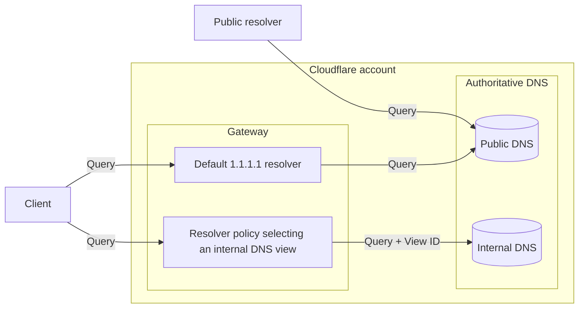
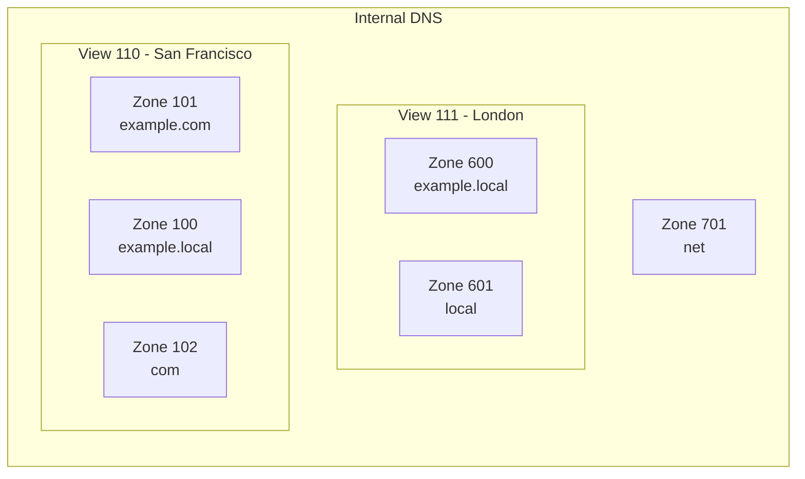
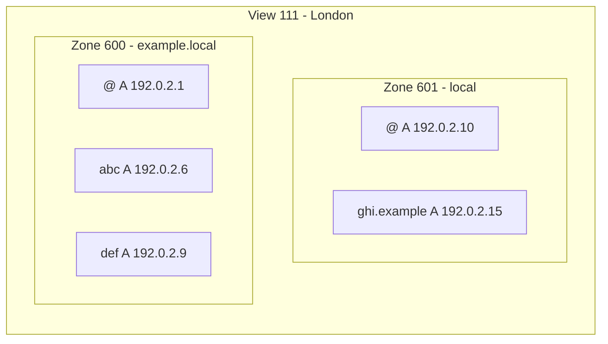

import {
	Render,
	Description,
	Plan,
	RelatedProduct,
	DirectoryListing,
	GlossaryTooltip,
	Example,
} from "~/components";

<Description>
	Simplify private network management with Cloudflare DNS for your internal
	resources.
</Description>

<Plan type="enterprise" />

Manage DNS records that should only be accessible within your private network. Internal DNS [zones](/dns/internal-dns/internal-zones/) and [views](/dns/internal-dns/dns-views/) pair up with [Gateway resolver policies](/cloudflare-one/traffic-policies/resolver-policies/) so that you can control how a DNS query should be responded to according to query context, such as query source IP.

<Render file="internal-dns-beta-note" product="dns" />

## Architecture overview

You can use different [connectivity options](/dns/internal-dns/connectivity/) to on-ramp your traffic to Cloudflare. Then, Cloudflare Gateway resolver acts as an interface between the DNS client and internal DNS zones.

Internal DNS zones do not get assigned Cloudflare nameservers and can only be queried via Cloudflare Gateway resolver.

Internal DNS zones are grouped into DNS views, which are selected by the resolver policy you define. Views are usually logical groupings relevant to your organization, such as different geographical locations.

Internal DNS zones contain the <GlossaryTooltip term="DNS record" link="/dns/internal-dns/internal-zones/internal-dns-records/">DNS records</ GlossaryTooltip> that should be used to resolve an internal DNS query. Also, if no internal record is found within a matching internal zone, Cloudflare will check if the matching internal zone is [referencing another internal zone](/dns/internal-dns/internal-zones/reference-zones/).

<Example>

In this example, a query for `ghi.example.local` routed to view ID 111 would go to zone 600, which presents the longest matching zone name (`example.local`). Zone 600 does not contain a record for `ghi` but, if it is referencing zone 601, Cloudflare will then look for the queried record within the reference zone.

</Example>

## Resources

<DirectoryListing />

## Related products

<RelatedProduct
	header="Cloudflare Gateway"
	href="/cloudflare-one/traffic-policies/"
	product="privacy-gateway"
>
	Set up policies to inspect DNS, Network, HTTP, and Egress traffic.
</RelatedProduct>

<RelatedProduct
	header="Cloudflare Magic WAN"
	href="/magic-wan/"
	product="magic-wan"
>
	Improve security and performance for your entire corporate networking,
	reducing cost and operation complexity.
</RelatedProduct>
