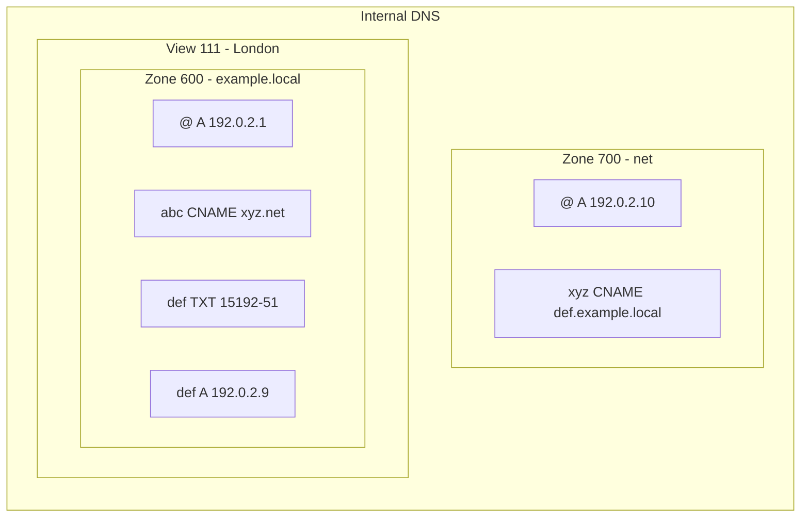

import { Details, Example } from "~/components";

Internal zones can contain the same [DNS record types](/dns/manage-dns-records/reference/dns-record-types/) that Cloudflare supports for public zones.

You can manage internal DNS records in the same way as you would manage public DNS records, with the difference that [proxy status](/dns/proxy-status/) does not apply to internal DNS records.

Refer to [Manage DNS records](/dns/manage-dns-records/how-to/create-dns-records/) or to the [API documentation](/api/resources/dns/subresources/records/) for further guidance.

## CNAME flattening in Internal DNS

With [CNAME flattening](/dns/cname-flattening/), Cloudflare finds the final target content that a CNAME points to and then returns this content instead of a CNAME record. With Internal DNS, CNAME flattening is applied by default and cannot be turned off.

Cloudflare will try to flatten the CNAME record considering both the specified [DNS view](/dns/internal-dns/dns-views/) and any existing [reference zones](/dns/internal-dns/internal-zones/reference-zones/). If the reference zone then has another CNAME, the record will again be considered from the perspective of the original view.

- Query for the `A` record on `abc.example.local` with view ID 111.
- Zone 600 references zone 700, which is not linked to any view.

After finding the CNAME record that points to `xyz.net`, Cloudflare cannot resolve it within zone 600. However, since this zone is referencing zone 700, this will be considered in the resolution.

The record in zone 700 points to `def.example.local`, which Cloudflare will then try to resolve in the original view. As an `A` record can be found for `def.example.local`, Cloudflare will return the corresponding IP address - in this example, `192.0.2.9`.

If it is not possible to flatten the CNAME record, the following will happen:

1. The CNAME record is returned to [Gateway resolver](/dns/internal-dns/#architecture-overview) as-is.
2. Gateway resolver will process the returned record, depending on the **Fallback through public DNS** configuration:
    - On: Gateway will try to resolve the query by sending it to Cloudflare's public DNS resolver ([1.1.1.1](/1.1.1.1/)).
    - Off: Gateway will return the response as-is to the client.