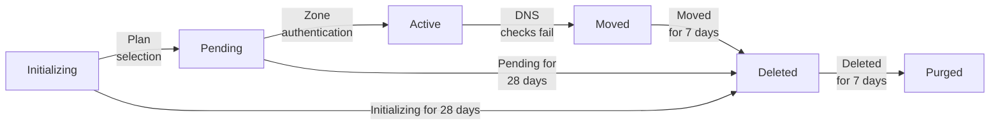

Review information on the different statuses that your [zone](/dns/concepts/#zone) can have after you [add your website or application](/fundamentals/manage-domains/add-site/) to Cloudflare.

Zone status is also referred to as domain status. An **active** domain status is a requirement for your [application services configurations](/fundamentals/manage-domains/add-site/) to be applied. Refer to [How Cloudflare works](/fundamentals/concepts/how-cloudflare-works/) for details.

If your zone status changes, you will receive an email at the address associated with your account.

The following diagram gives you an overview of the different statuses applicable and how your zone may transition from one status to the other. For zones with an active paid subscription, the time to automatic deletion or purge may not correspond to this diagram. Refer to the sections below for details.

:::note

If you use the API to add your website or application to Cloudflare, your zone will be created directly in a **Pending** status. **Initializing** only applies to domains added via the dashboard.
:::

## Initializing (Setup)

You have initiated the setup via dashboard, but did not select a plan for your zone. Your zone status is presented as **Setup** on the Cloudflare dashboard.

In this state, Cloudflare does not respond to any DNS queries for your domain.

If your zone is in **Setup** for over 28 days, it will be automatically [deleted](#deleted).

## Pending

Your zone status is presented as **Pending Nameserver Update** on the Cloudflare dashboard.

:::note
If you have mistakenly added a zone to your account it will appear as pending. It can be safely [removed](/fundamentals/manage-domains/remove-domain/).
:::

Cloudflare responds to DNS queries for pending zones on the assigned Cloudflare nameserver IPs, but your zone is still not active and cannot be used to [proxy traffic to Cloudflare](/dns/proxy-status/limitations/#pending-domains).

### Causes

* [Full setup](/dns/zone-setups/full-setup/): You have either not [changed your authoritative nameservers](/dns/nameservers/update-nameservers/) or your change has not yet been authenticated by Cloudflare.
* [Partial (CNAME) setup](/dns/zone-setups/partial-setup/): You have either not added the verification TXT record to your authoritative DNS provider or the record has not yet been authenticated by Cloudflare.

After you add your domain, Cloudflare performs checks on a schedule to confirm you have updated your nameservers. The first check occurs after 60 seconds and the following attempts happen at gradually increased intervals. You can re-trigger the check [via API](/api/resources/zones/subresources/activation_check/methods/trigger/) or on the Dashboard, in the respective domain [Overview page](https://dash.cloudflare.com/?to=/:account/:zone/).

### Expected behavior for different plans

If your domain is on the Free plan, it will be automatically deleted if it is not activated within 28 days.

Any pending zone with a paid plan (Pro, Business, Enterprise) will remain pending until the plan is removed, or the domain is activated or [removed from Cloudflare](/fundamentals/manage-domains/remove-domain/).

:::caution[Do not use pending zones in production]
Make sure not to use pending zones for production traffic. Cloudflare responds to DNS queries for pending zones on the assigned Cloudflare nameserver IPs but there are associated risks, especially if you do not use [zone holds](/fundamentals/account/account-security/zone-holds/).
:::

For Enterprise zones, if you want to adjust settings before zone activation, Logpush for [DNS logs](/logs/logpush/logpush-job/datasets/zone/dns_logs/) and [DNS Zone Transfer](/dns/zone-setups/zone-transfers/) configuration work as expected in pending state.

## Active

Cloudflare has authenticated your [nameserver changes](/dns/nameservers/update-nameservers/) or [verification TXT record](/dns/zone-setups/partial-setup/setup/#2-verify-ownership-for-your-domain) and you can proxy domain traffic through Cloudflare. For more details refer to [How Cloudflare works](/fundamentals/concepts/how-cloudflare-works/) and [Domain configurations](/fundamentals/manage-domains/add-site/).

## Moved

Your domain has failed multiple DNS checks, where either the Cloudflare nameservers are no longer present on your domain's `NS` records ([Full setup](/dns/zone-setups/full-setup/)) or no `SOA` record is returned for the zone ([Partial (CNAME) setup](/dns/zone-setups/partial-setup/)).

### Expected behavior for different plans

If your domain is on the Free plan, it will be automatically deleted 7 days after it entered the moved status.

For moved zones with a paid plan (Pro, Business, Enterprise), deletion will occur after 7 days if any of the following is observed:

- The paid plan is removed.
- The domain is activated in another Cloudflare account.

You can also [manually remove](/fundamentals/manage-domains/remove-domain/) your domain from Cloudflare.

## Deleted

Your zone has been archived. Cloudflare still responds to DNS queries for deleted zones on the assigned Cloudflare nameserver IPs (for non-deleted DNS records) and you can re-add the domain to Cloudflare by following the [regular onboarding flow](/fundamentals/manage-domains/add-site/).

After being deleted for seven days, zones are automatically [purged](#purged).

## Purged

After a zone is deleted for seven days, it will be purged. Cloudflare does not respond to DNS queries for purged zones and, unlike [deleted zones](#deleted), this status cannot be reverted. In this case, even if you re-add the domain to the same Cloudflare account, none of the zone settings are expected to be restored.
