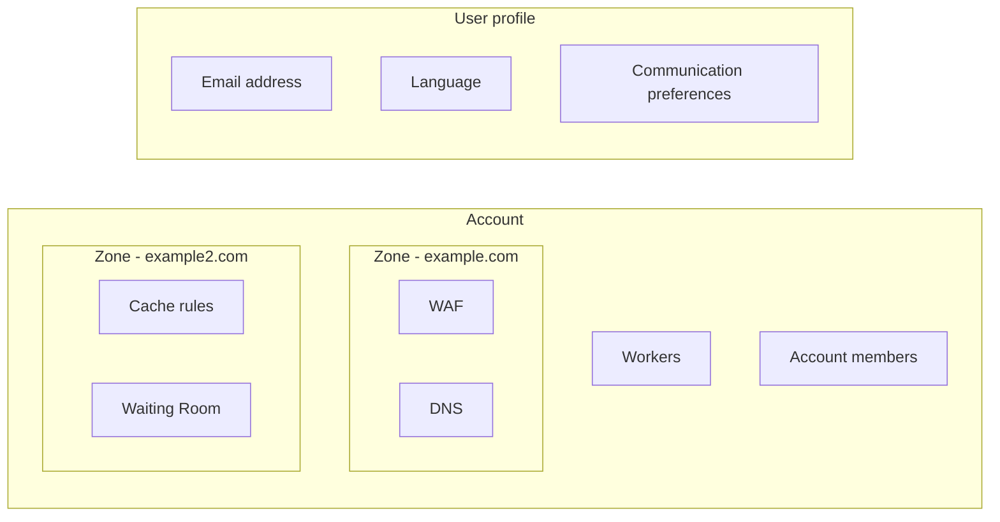

import { Render } from "~/components";

Within the Cloudflare ecosystem, there are three organizing concepts that control where specific settings live: user profiles, accounts, and zones.

---

## User profiles

<Render file="user-profiles" product="fundamentals" />

## Accounts

An account refers to an organization account, which contains one or more users and zones. Users can belong to multiple accounts, and each account maintains its own settings, including [billing profiles](/billing/create-billing-profile/), [account members](/fundamentals/manage-members/), [lists](/waf/tools/lists/), and other configurations.

Several account-level products - such as [Workers](/workers/), [Pages](/pages/), [Security Center](/security-center/), and [Bulk redirects](/rules/url-forwarding/bulk-redirects/) - can affect some or all zones contained within that account.

After you [log in](https://dash.cloudflare.com) and select an account - but before you select a zone - the sidebar will list account-level products.

When you log into the [Cloudflare dashboard](https://dash.cloudflare.com), you can access all accounts where your user is a member. To access account settings and account-level products from within a zone, use the **Accounts** option from the navigation sidebar.

## Zones

Domains (or [subdomains](/dns/zone-setups/subdomain-setup/)) that are added to Cloudflare become zones[^1], which have a direct impact on the security and performance of your website, application, or API. Use your zone to monitor security and performance, update configurations, and apply zone-level products and services.

Zone-level services - such as [Load Balancers](/load-balancing/) and [Cache rules](/cache/how-to/cache-rules/) - only affect your website, application, or API for that zone and not other zones, even if they are contained within the same account.

When you log into the [Cloudflare dashboard](https://dash.cloudflare.com) and choose an account, you can view a list of all zones within that account.

Once you are within a zone, items within the sidebar will be zone-related products. If you need to change to another zone, use the forward arrow next to the zone name or by go back to the homepage of your account.

[^1]: Similar to [DNS zones](https://www.cloudflare.com/learning/dns/glossary/dns-zone/), but with additional capabilities.
