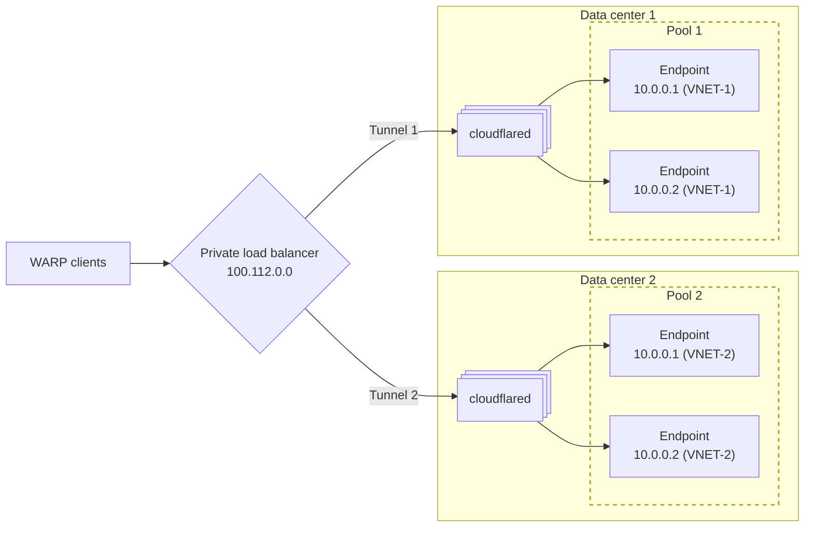

import {
	DashButton,
	Render,
	Tabs,
	TabItem,
	APIRequest,
	GlossaryTooltip,
} from "~/components";

You can use Private Network Load Balancing to distribute WARP client traffic to private hostnames and IPs connected via [Cloudflare Tunnel](/cloudflare-one/networks/connectors/cloudflare-tunnel/).

For example, assume you have an internal application running in two data centers, and you want WARP users to access the application from the data center closest to their geographic location. A typical load balancing configuration is shown in the following diagram:

The components in the diagram include:

- **cloudflared**: Each data center is connected to Cloudflare with its own Cloudflare Tunnel. `cloudflared` installs on one or [more](/cloudflare-one/networks/connectors/cloudflare-tunnel/configure-tunnels/tunnel-availability/#cloudflared-replicas) host machines in the network.
- **Private load balancer IP**: End users connect to the application using the load balancer's IP address. This can either be a Cloudflare-assigned IP in `100.112.0.0/16` or a custom `/32` IP in an [RFC 1918 range](https://datatracker.ietf.org/doc/html/rfc1918).
- **Load balancer pool**: The load balancer is configured with one [pool](/load-balancing/understand-basics/load-balancing-components/#pools) per tunnel.
- **Load balancer endpoint**: A pool contains one or more endpoints, where each endpoint is a server behind `cloudflared` that is running the application. If your servers have overlapping IPs, you can assign a distinct [virtual network (VNET)](/cloudflare-one/networks/connectors/cloudflare-tunnel/private-net/cloudflared/tunnel-virtual-networks/) per tunnel so that Load Balancer can deterministically route requests to the correct endpoint.

:::note
Load Balancing does not currently support [private hostname routing](/cloudflare-one/networks/connectors/cloudflare-tunnel/private-net/cloudflared/connect-private-hostname/). Load balancing endpoints must be defined using an IP address and virtual network (for example, `10.0.0.1 (VNET-1)`).
:::

## Prerequisites

- Your endpoint IP addresses route through Cloudflare Tunnel. To learn how to connect your private network, refer to [Connect an IP/CIDR](/cloudflare-one/networks/connectors/cloudflare-tunnel/private-net/cloudflared/connect-cidr/).

## 1. Create load balancer pools

Load balancer pools are logical groupings of endpoints, typically organized by physical datacenter or geographic region. The endpoints in the pool are the destinations where traffic is ultimately routed.

Pools can be created using either the Cloudflare dashboard or the API.

<Tabs syncKey="dashPlusAPI">

<TabItem label="Dashboard">

To create a pool using the dashboard, refer to the [Create a pool](/load-balancing/pools/create-pool/#create-a-pool) documentation.

:::note[Endpoint IP address limitations]

- All endpoints with private IPs must have a [virtual network (VNET)](/cloudflare-one/networks/connectors/cloudflare-tunnel/private-net/cloudflared/tunnel-virtual-networks/) specified. If you did not select a VNET when adding a Cloudflare Tunnel route, the endpoint will be assigned to the `default` VNET.
- A pool cannot have multiple endpoints with the same IP address, even when using different virtual networks. You can assign endpoints with overlapping IPs to different pools, as shown in the [example diagram](#_top).
:::

</TabItem>

<TabItem label="API">

To get a list of your current virtual networks, use the [List virtual networks](/api/resources/zero_trust/subresources/networks/subresources/virtual_networks/methods/list/) API operation.

Enable virtual/private IP support by adding the `virtual_network_id` field to the `origins` in your API request. Refer to the [Cloudflare Load Balancer API documentation](/api/resources/load_balancers/subresources/pools/methods/create/) for more information on how to create a pool using the API.

The following example adds a Cloudflare Tunnel endpoint to an existing Load Balancer pool:

<APIRequest
	path="/accounts/{account_id}/load_balancers/pools/{pool_id}"
	method="PATCH"
	json={{
		origins: [
			{
				name: "server-1",
				address: "10.0.0.1",
				enabled: true,
				weight: 1,
				virtual_network_id: "a5624d4e-044a-4ff0-b3e1-e2465353d4b4",
			},
		],
	}}
/>

</TabItem>
</Tabs>

## 2. Create a private load balancer

1. In the Cloudflare dashboard, go to the **Load Balancing** page.

   <DashButton url="/?to=/:account/load-balancing" />

2. Select **Create a Load Balancer**.
3. Select **Private Load Balancer**.
4. On the next step you can choose to associate this load balancer with either:
	- A Cloudflare-assigned IP from the `100.112.0.0/16` range
	- A custom `/32` IP in an [RFC 1918 range](https://datatracker.ietf.org/doc/html/rfc1918)
5. Add a descriptive name to identify your load balancer.
6. Proceed through the setup.

After completing the setup, you will be redirected to the Load Balancing dashboard. You can locate your load balancer using the search bar or by filtering for **Private** load balancers. Be sure to note the load balancer IP as it will be required in the following steps.

## 3. Route the load balancer IP through WARP

In order for WARP clients to connect to your load balancer, the load balancer's IP address must route through the WARP tunnel in your [Split Tunnel settings](/cloudflare-one/team-and-resources/devices/warp/configure-warp/route-traffic/split-tunnels/).

1. In [Zero Trust](https://one.dash.cloudflare.com), go to **Settings** > **WARP Client**.
2. Under **Device settings**, find the [device profile](/cloudflare-one/team-and-resources/devices/warp/configure-warp/device-profiles/) you would like to modify and select **Edit**.
3. Under **Split Tunnels**, check whether your [Split Tunnels mode](/cloudflare-one/team-and-resources/devices/warp/configure-warp/route-traffic/split-tunnels/#change-split-tunnels-mode) is set to **Exclude** or **Include**.
4. Select **Manage**. Depending on the mode:
   - **Exclude mode**: Delete the IP range that contains your load balancer IP. For example, if your load balancer has a Cloudflare-assigned CGNAT IP, delete `100.64.0.0/10`. We recommend [adding back the IPs](/cloudflare-one/networks/connectors/cloudflare-tunnel/private-net/cloudflared/connect-cidr/#3-route-private-network-ips-through-warp) that are not being used by your load balancer.
     :::note
     Some IPs in the `100.64.0.0/10` range may be reserved for other Zero Trust services such as Gateway <GlossaryTooltip term = "initial resolved IP">initial resolved IPs</GlossaryTooltip> or <GlossaryTooltip term = "CGNAT IP">WARP CGNAT IPs</GlossaryTooltip>. These IPs should remain deleted from the Exclude list.
		 :::
   - **Include mode**: Add your load balancer IP.

WARP traffic can now reach your private load balancer. For example, if your load balancer points to a web application, you can test by running `curl <load-balancer-IP>` from the WARP device. This traffic will be distributed over Cloudflare Tunnel to your private endpoints according to your configured steering method.

## 4. (Optional) Assign a hostname to the load balancer

If you want your load balancer and its endpoints to be transparently accessible to users via a hostname, you can create a Gateway DNS [Override policy](/cloudflare-one/traffic-policies/dns-policies/#override) that maps the hostname to the load balancer's IP address. This ensures that traffic destined for the hostname resolves to the correct IP.

1. In [Zero Trust](https://one.dash.cloudflare.com), go to **Gateway** > **Firewall policies**> **DNS**.
2. Select **Add DNS policy**.
3. In **Traffic**, create an expression where the **Selector** equals `Host`, the **Operator** equals `is`, and **Value** is the hostname you wish to associate with your load balancer. For example,

   | Selector | Operator | Value                |
   | -------- | -------- | -------------------- |
   | Host     | is       | `app.internal.local` |

4. Set the **Action** to _Override_.
5. In **Override Hostname**, enter your private load balancer IP (for example, `100.112.0.0`).

Requests to the hostname will now resolve to your private load balancer.
