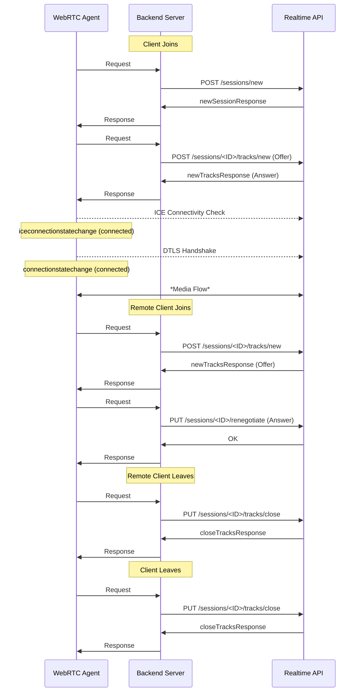

Cloudflare Realtime simplifies the management of peer connections and media tracks through HTTPS API endpoints. These endpoints allow developers to efficiently manage sessions, add or remove tracks, and gather session information.

## API Endpoints

- **Create a New Session**: Initiates a new session on Cloudflare Realtime, which can be modified with other endpoints below.
  - `POST /apps/{appId}/sessions/new`
- **Add a New Track**: Adds a media track (audio or video) to an existing session.
  - `POST /apps/{appId}/sessions/{sessionId}/tracks/new`
- **Renegotiate a Session**: Updates the session's negotiation state to accommodate new tracks or changes in the existing ones.
  - `PUT /apps/{appId}/sessions/{sessionId}/renegotiate`
- **Close a Track**: Removes a specified track from the session.
  - `PUT /apps/{appId}/sessions/{sessionId}/tracks/close`
- **Retrieve Session Information**: Fetches detailed information about a specific session.
  - `GET /apps/{appId}/sessions/{sessionId}`

[View full API and schema (OpenAPI format)](/realtime/static/calls-api-2024-05-21.yaml)

## Handling Secrets

It is vital to manage App ID and its secret securely. While track and session IDs can be public, they should be protected to prevent misuse. An attacker could exploit these IDs to disrupt service if your backend server does not authenticate request origins properly, for example by sending requests to close tracks on sessions other than their own. Ensuring the security and authenticity of requests to your backend server is crucial for maintaining the integrity of your application.

## Using STUN and TURN Servers

Cloudflare Realtime is designed to operate efficiently without the need for TURN servers in most scenarios, as Cloudflare exposes a publicly routable IP address for Realtime. However, integrating a STUN server can be necessary for facilitating peer discovery and connectivity.

- **Cloudflare STUN Server**: `stun.cloudflare.com:3478`

Utilizing Cloudflare's STUN server can help the connection process for Realtime applications.

## Lifecycle of a Simple Session

This section provides an overview of the typical lifecycle of a simple session, focusing on audio-only applications. It illustrates how clients are notified by the backend server as new remote clients join or leave, incorporating video would introduce additional tracks and considerations into the session.

