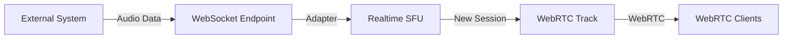
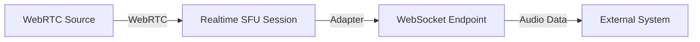

import { Render, Tabs, TabItem } from "~/components";

:::note
WebSocket adapter is in beta. The API may change.
:::

Stream audio between WebRTC tracks and WebSocket endpoints. Supports ingesting audio from WebSocket sources and sending WebRTC audio to WebSocket consumers.

## What you can build

- AI services with WebSocket APIs for audio processing
- Custom audio processing pipelines
- Legacy system bridges
- Server-side audio generation and consumption

## How it works

<Tabs>
<TabItem label="Ingest (WebSocket → WebRTC)">

### Create WebRTC tracks from external audio

Ingest audio from external sources via WebSocket to create WebRTC tracks for distribution.



**Use cases:**
- AI text-to-speech generation streaming into WebRTC
- Audio from backend services or databases
- Live audio feeds from external systems

**Key characteristics:**
- Creates a new session ID automatically
- Uses `buffer` mode for chunked audio transmission
- Maximum 32 KB per WebSocket message

</TabItem>
<TabItem label="Stream (WebRTC → WebSocket)">

### Stream WebRTC audio to external systems

Stream audio from existing WebRTC tracks to external systems via WebSocket for processing or storage.



**Use cases:**
- Real-time speech-to-text transcription
- Audio recording and archival
- Live audio processing pipelines

**Key characteristics:**
- Requires existing session ID with track
- Sends individual audio frames as they are produced
- Each frame includes timestamp and sequence number

</TabItem>
</Tabs>

## API reference

### Create adapter

```
POST /v1/apps/{appId}/adapters/websocket/new
```

<Tabs>
<TabItem label="Ingest">

#### Request body

```json
{
  "tracks": [
    {
      "location": "local",
      "trackName": "string",
      "endpoint": "wss://...",
      "inputCodec": "pcm",
      "mode": "buffer"
    }
  ]
}
```

#### Parameters

| Parameter | Type | Description |
|-----------|------|-------------|
| `location` | string | **Required**. Must be `"local"` for ingesting audio |
| `trackName` | string | **Required**. Name for the new WebRTC track to create |
| `endpoint` | string | **Required**. WebSocket URL to receive audio from |
| `inputCodec` | string | **Required**. Codec of incoming audio. Currently only `"pcm"` |
| `mode` | string | **Required**. Must be `"buffer"` for local mode |

#### Response

```json
{
  "tracks": [
    {
      "trackName": "string",
      "adapterId": "string",
      "sessionId": "string",    // New session ID generated
      "endpoint": "string"      // Echo of the requested endpoint
    }
  ]
}
```

:::note[Important]
- A new session ID is automatically generated.
- The `sessionId` field in the request is ignored if provided.
- Send audio in chunks up to 32 KB per WebSocket message.
:::

</TabItem>
<TabItem label="Stream">

#### Request body

```json
{
  "tracks": [
    {
      "location": "remote",
      "sessionId": "string",
      "trackName": "string",
      "endpoint": "wss://...",
      "outputCodec": "pcm"
    }
  ]
}
```

#### Parameters

| Parameter | Type | Description |
|-----------|------|-------------|
| `location` | string | **Required**. Must be `"remote"` for streaming audio out |
| `sessionId` | string | **Required**. Existing session ID containing the track |
| `trackName` | string | **Required**. Name of the existing track to stream |
| `endpoint` | string | **Required**. WebSocket URL to send audio to |
| `outputCodec` | string | **Required**. Codec for outgoing audio. Currently only `"pcm"` |

#### Response

```json
{
  "tracks": [
    {
      "trackName": "string",
      "adapterId": "string",
      "sessionId": "string",    // Same as request sessionId
      "endpoint": "string"      // Echo of the requested endpoint
    }
  ]
}
```

:::note[Important]
- Requires an existing session with the specified track.
- Frames are sent individually with timestamp and sequence number.
- Each frame is a separate WebSocket message.
- No mode parameter; frames are sent as produced.
:::

</TabItem>
</Tabs>

### Close adapter

```
POST /v1/apps/{appId}/adapters/websocket/close
```

#### Request body

```json
{
  "tracks": [
    {
      "adapterId": "string"
    }
  ]
}
```

## Audio format

### WebRTC tracks

- **Codec**: Opus
- **Sample rate**: 48 kHz
- **Channels**: Stereo

### WebSocket binary format

Audio uses Protocol Buffers and PCM payloads:

- 16-bit signed little-endian PCM
- 48 kHz sample rate
- Stereo (left/right interleaved)

```protobuf
message Packet {
    uint32 sequenceNumber = 1;  // Used in Stream mode only
    uint32 timestamp = 2;       // Used in Stream mode only
    bytes payload = 5;          // Audio data
}
```

**Ingest mode (buffer)**: Only the `payload` field is used, containing chunks of audio data.

**Stream mode**: All fields are populated:
- `sequenceNumber`: Incremental packet counter
- `timestamp`: Timestamp for synchronization  
- `payload`: Individual audio frame data

## Connection protocol

Connects to your WebSocket endpoint:

1. WebSocket upgrade handshake
2. Secure connection for `wss://` URLs
3. Audio streaming begins

### Message format

#### Buffer mode (ingest)
- **Binary messages**: PCM audio data in chunks
- **Maximum message size**: 32 KB per WebSocket message
- **Important**: Account for serialization overhead when chunking audio buffers
- Send audio in small, frequent chunks rather than large batches

#### Stream mode (egress)  
- **Binary messages**: Individual audio frames with metadata
- Each frame includes:
  - Timestamp information
  - Sequence number
  - PCM audio frame data
- Frames are sent individually as they arrive from the WebRTC track

### Connection lifecycle

1. Connects to the WebSocket endpoint
2. Audio streaming begins
3. Connection closes when closed or on error

## Pricing

Currently in beta and free to use.

Once generally available, billing will follow standard Cloudflare Realtime pricing at $0.05 per GB egress. Only traffic originating from Cloudflare towards WebSocket endpoints incurs charges. Traffic ingested from WebSocket endpoints into Cloudflare incurs no charge.

Usage counts towards your Cloudflare Realtime free tier of 1,000 GB.

## Best practices

### Connection management

- Closing an already-closed instance returns success
- Close when sessions end
- Implement reconnection logic for network failures

### Performance

- Deploy WebSocket endpoints close to Cloudflare edge
- Use appropriate buffer sizes
- Monitor connection quality

### Security

- Secure WebSocket endpoints with authentication
- Use `wss://` for production
- Implement rate limiting

## Limitations

- **WebSocket payloads**: PCM only (16-bit, 48 kHz, stereo)
- **Beta status**: API may change in future releases
- **Audio only**: Video streaming not yet supported
- **Unidirectional flow**: Each instance handles one direction

## Error handling

| Error Code | Description |
|------------|-------------|
| `400` | Invalid request parameters |
| `404` | Session or track not found |
| `503` | Adapter not found (for close operations) |

## Reference implementation

See [Cloudflare Realtime Examples](https://github.com/cloudflare/realtime-examples/tree/main/ai-tts-stt).

## Migration from custom bridges

1. Replace custom signaling with adapter API calls
2. Update WebSocket endpoints to handle PCM format
3. Implement adapter lifecycle management
4. Remove custom STUN/TURN configuration

## FAQ

**Q: Can I use the same adapter for bidirectional audio?**
A: No, each instance is unidirectional. Create separate adapters for send and receive.

**Q: What happens if the WebSocket connection drops?**
A: The adapter closes and must be recreated. Implement reconnection logic in your app.

**Q: Is there a limit on concurrent adapters?**
A: Limits follow standard Cloudflare Realtime quotas. Contact support for specific requirements.

**Q: Can I change the audio format after creating an adapter?**
A: No, audio format is fixed at creation time. Create a new adapter for different formats.
