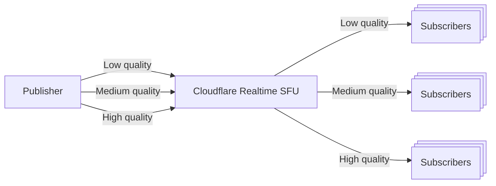

Simulcast is a feature of WebRTC that allows a publisher to send multiple video streams of the same media at different qualities. For example, this is useful for scenarios where you want to send a high quality stream for desktop users and a lower quality stream for mobile users.



### How it works

Simulcast in WebRTC allows a single video source, like a camera or screen share, to be encoded at multiple quality levels and sent simultaneously, which is beneficial for subscribers with varying network conditions and device capabilities. The video source is encoded into multiple streams, each identified by RIDs (RTP Stream Identifiers) for different quality levels, such as low, medium, and high. These simulcast streams are described in the SDP you send to Cloudflare Realtime SFU. It's the responsibility of the Cloudflare Realtime SFU to ensure that the appropriate quality stream is delivered to each subscriber based on their network conditions and device capabilities.

Cloudflare Realtime SFU will automatically handle the simulcast configuration based on the SDP you send to it from the publisher. The SFU will then automatically switch between the different quality levels based on the subscriber's network conditions, or the quality level can be controlled manually via the API. You can control the quality switching behavior using the `simulcast` configuration object when you send an API call to start pulling a remote track.

### Quality Control

The `simulcast` configuration object in the API call when you start pulling a remote track allows you to specify:

- `preferredRid`: The preferred quality level for the video stream (RID for the simulcast stream. [RIDs can be specified by the publisher.](https://developer.mozilla.org/en-US/docs/Web/API/RTCRtpSender/setParameters#encodings))
- `priorityOrdering`: Controls how the SFU handles bandwidth constraints.
  - `none`: Keep sending the preferred layer, set via the preferredRid, even if there's not enough bandwidth.
  - `asciibetical`: Use alphabetical ordering (a-z) to determine priority, where 'a' is most desirable and 'z' is least desirable.
- `ridNotAvailable`: Controls what happens when the preferred RID is no longer available, for example when the publisher stops sending it.
  - `none`: Do nothing.
  - `asciibetical`: Switch to the next available RID based on the priority ordering, where 'a' is most desirable and 'z' is least desirable.

  You will likely want to order the asciibetical RIDs based on your desired metric, such as higest resoltion to lowest or highest bandwidth to lowest.

### Bandwidth Management across media tracks

Cloudflare Realtime treats all media tracks equally at the transport level. For example, if you have multiple video tracks (cameras, screen shares, etc.), they all have equal priority for bandwidth allocation. This means:

1. Each track's simulcast configuration is handled independently
1. The SFU performs automatic bandwidth estimation and layer switching based on network conditions independently for each track

### Layer Switching Behavior

When a layer switch is requested (through updating `preferredRid`) with the `/tracks/update` API:

1. The SFU will automatically generate a Full Intraframe Request (FIR)
2. PLI generation is debounced to prevent excessive requests

### Publisher Configuration

For publishers (local tracks), you only need to include the simulcast attributes in your SDP. The SFU will automatically handle the simulcast configuration based on the SDP. For example, the SDP should contain a section like this:

```txt
a=simulcast:send f;h;q
a=rid:f send
a=rid:h send
a=rid:q send
```

If the publisher endpoint is a browser you can include these by specifying `sendEncodings` when creating the transceiver like this:

```js
const transceiver = peerConnection.addTransceiver(track, {
	direction: "sendonly",
	sendEncodings: [
		{ scaleResolutionDownBy: 1, rid: "f" },
		{ scaleResolutionDownBy: 2, rid: "h" },
		{ scaleResolutionDownBy: 4, rid: "q" },
	],
});
```

## Example

Here's an example of how to use simulcast with Cloudflare Realtime:

1. Create a new local track with simulcast configuration. There should be a section in the SDP with `a=simulcast:send`.
2. Use the [Cloudflare Realtime API](/realtime/sfu/https-api) to push this local track, by calling the /tracks/new endpoint.
3. Use the [Cloudflare Realtime API](/realtime/sfu/https-api) to start pulling a remote track (from another browser or device), by calling the /tracks/new endpoint and specifying the `simulcast` configuration object along with the remote track ID you get from step 2.

For more examples, check out the [Realtime Examples GitHub repository](https://github.com/cloudflare/calls-examples/tree/main/echo-simulcast).
