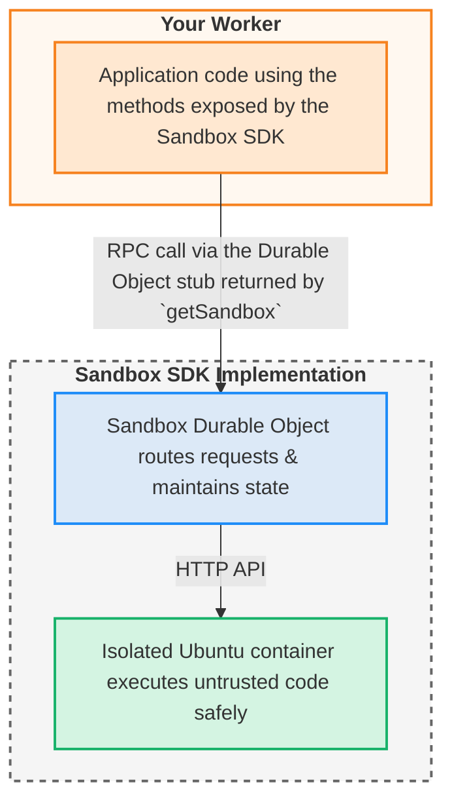

Sandbox SDK lets you execute untrusted code safely from your Workers. It combines three Cloudflare technologies to provide secure, stateful, and isolated execution:

- **Workers** - Your application logic that calls the Sandbox SDK
- **Durable Objects** - Persistent sandbox instances with unique identities
- **Containers** - Isolated Linux environments where code actually runs

## Architecture overview



### Layer 1: Client SDK

The developer-facing API you use in your Workers:

```typescript
import { getSandbox } from "@cloudflare/sandbox";

const sandbox = getSandbox(env.Sandbox, "my-sandbox");
const result = await sandbox.exec("python script.py");
```

**Purpose**: Provide a clean, type-safe TypeScript interface for all sandbox operations.

### Layer 2: Durable Object

Manages sandbox lifecycle and routing:

```typescript
export class Sandbox extends DurableObject<Env> {
	// Extends Cloudflare Container for isolation
	// Routes requests between client and container
	// Manages preview URLs and state
}
```

**Purpose**: Provide persistent, stateful sandbox instances with unique identities.

**Why Durable Objects**:

- **Persistent identity** - Same sandbox ID always routes to same instance
- **Container management** - Durable Object owns and manages the container lifecycle
- **Geographic distribution** - Sandboxes run close to users
- **Automatic scaling** - Cloudflare manages provisioning

### Layer 3: Container Runtime

Executes code in isolation with full Linux capabilities.

**Purpose**: Safely execute untrusted code.

**Why containers**:

- **VM-based isolation** - Each sandbox runs in its own VM
- **Full environment** - Ubuntu Linux with Python, Node.js, Git, etc.

## Request flow

When you execute a command:

```typescript
await sandbox.exec("python script.py");
```

1. **Client SDK** validates parameters and sends HTTP request to Durable Object
2. **Durable Object** authenticates and routes to container runtime
3. **Container Runtime** validates inputs, executes command, captures output
4. **Response flows back** through all layers with proper error transformation

## Related resources

- [Sandbox lifecycle](/sandbox/concepts/sandboxes/) - How sandboxes are created and managed
- [Container runtime](/sandbox/concepts/containers/) - Inside the execution environment
- [Security model](/sandbox/concepts/security/) - How isolation and validation work
- [Session management](/sandbox/concepts/sessions/) - Advanced state management
