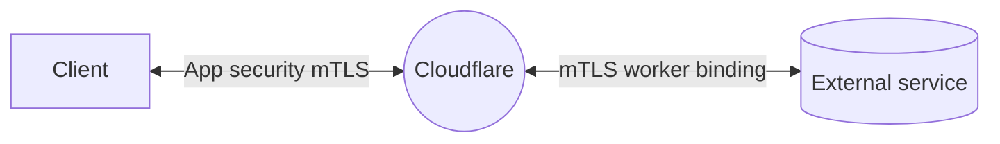

import { GlossaryDefinition, Render, DirectoryListing } from "~/components";

Use Cloudflare's public key infrastructure (PKI) to create client certificates, or [bring your own CA for mTLS](/ssl/client-certificates/byo-ca/).

<GlossaryDefinition term="mTLS (mutual TLS)" />

:::note[mTLS at Cloudflare]
For a broader overview, refer to the [mTLS at Cloudflare learning path](/learning-paths/mtls/concepts/).
:::

---

## How it works

Client certificates issued from a given CA are installed on client devices that should be granted access. Then, for any host that has [mTLS enabled](/ssl/client-certificates/enable-mtls/), Cloudflare - acting as the server in this case - requires a certificate from the client trying to access the hostname.

Cloudflare then validates the client certificate against CAs set at account level. This means that these certificates can be used for validation across multiple zones/domains (`example.com`), as long as the zones are under the same Cloudflare account and mTLS has been enabled for the requested hosts (`host.example.com`).

The account-level CAs can be:

- The Cloudflare-managed CA: This is the default option. Certificates and hostname associations are listed on your [dashboard](https://dash.cloudflare.com/?to=/:account/:zone/ssl-tls/client-certificates/).
- [BYOCA](/ssl/client-certificates/byo-ca/) certificates: This is an API-only option, available on Enterprise accounts. Certificates and hostname associations are **not** listed on your [dashboard](https://dash.cloudflare.com/?to=/:account/:zone/ssl-tls/client-certificates/).

---

## Use cases

As explained in the [mTLS learning path](/learning-paths/mtls/concepts/), there are different use cases and implementation options for mTLS. Consider the following links for specific guidance.

- [Application security](/learning-paths/mtls/mtls-app-security/)
- [mTLS for Zero Trust](/cloudflare-one/access-controls/service-credentials/mutual-tls-authentication/) (Cloudflare Access integration)
- [mTLS with API Shield](/api-shield/security/mtls/configure/)
- [mTLS Workers binding](/workers/runtime-apis/bindings/mtls/)

Apart from the mTLS Workers binding, any of the above implementations can use your own CA instead of the Cloudflare-managed one. Refer to [Bring your own CA](/ssl/client-certificates/byo-ca/).

### mTLS and Workers

Use the [mTLS Workers binding](/workers/runtime-apis/bindings/mtls/) when you need your worker to present a client certificate to an external service. To authenticate requests from a client to your worker instead, refer to [SSL/TLS > Client certificates](https://dash.cloudflare.com/?to=/:account/:zone/ssl-tls/client-certificates/) and the regular [mTLS for application security](/learning-paths/mtls/mtls-app-security/) implementation.

