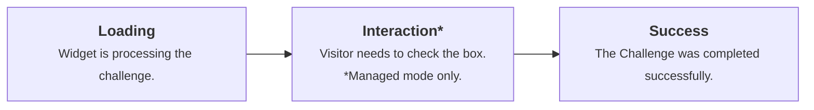

import { GlossaryTooltip, Render } from "~/components";

Every instance of Turnstile belongs to a Turnstile widget. It is configured on a per-widget level. Every widget has a mode, a label, a <GlossaryTooltip term="sitekey">sitekey</GlossaryTooltip>, and a <GlossaryTooltip term="secret key">secret key</GlossaryTooltip>.

Turnstile is hosted under `challenges.cloudflare.com`. Your application will connect to this origin.

## Widget components

<Render file="widget-components" product="turnstile" />

## Widget modes

The available modes for Turnstile widgets are **Managed**, **Non-Interactive**, and **Invisible**.

### Managed mode (recommended)

Managed mode is fully managed by Cloudflare. It automatically chooses the appropriate action based on client-side signals and risk levels. Cloudflare uses the information from the visitor to decide if an interactive challenge should be used.

Turnstile will only require interaction if a further check is necessary to verify that the visitor is human. When an interaction is required, the visitor will be prompted to select a box. There will be no images or text to decipher.

Managed mode is ideal for users who want a simple configuration without needing to fine-tune the widget's behavior.

### Non-Interactive mode

Visitors will see a widget with a loading spinner while the challenges run in their browsers. Unlike managed mode, visitors will never be required or prompted to interact with the widget.

Non-Interactive mode is ideal for users who want to prioritize visitor experience and do not want to add any friction on their website with a Turnstile interaction.

### Invisible mode

Invisible mode is similar to Non-Interactive mode where visitors will never interact with the Turnstile widget. Visitors will also not see a widget or any indication that an invisible browser challenge is in progress.

Invisible mode is ideal for users who want to prioritize visitor and visual experience on their website.

---

## Widget customization

### Sizes

Widgets can be implemented in normal, flexible, or compact sizes.

Refer to [Widget configurations](/turnstile/get-started/client-side-rendering/widget-configurations/) for detailed configuration options and code examples.

### Appearance and themes

Turnstile widgets support multiple appearance modes and themes to match your website's design.

Refer to [Widget configurations](/turnstile/get-started/client-side-rendering/widget-configurations/) for implementation details.

---

## Widget states

### Normal operation states

### Error states

| 
Type
 | Description |
| ---- | ----------- |
| Unknown error | When an unknown error occurs during the challenge, visitors will encounter this widget state. Visitors can follow the troubleshooting guidelines from the widget or refresh the page to retry the challenge. |
| Interaction timed out | When the visitor is presented with a checkbox but does not interact with it for an extended period of time. The challenge must be reissued by reloading the page or the widget. |
| Challenge timed out | When the verification was completed but no further action has been taken, the challenge outcome will no longer be valid. For example, if a Turnstile widget is on a login page and the Turnstile successfully ran, but the visitor did not log in for an extended period of time, the challenge must be reissued by reloading the page or the widget. |
| Outdated or unsupported browser | Visitors with outdated browsers or unsupported browsers will encounter this widget state. Refer to [Supported browsers](/cloudflare-challenges/reference/supported-browsers/) for more information regarding supported browsers. |
