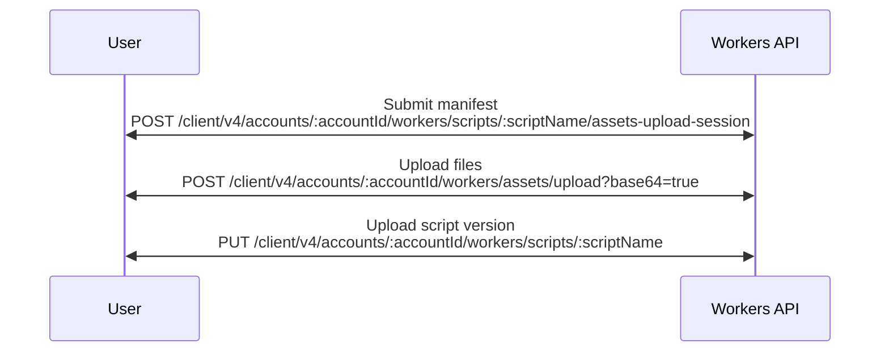
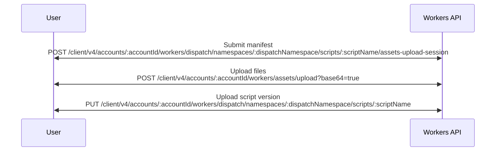

import {
	Badge,
	Description,
	FileTree,
	GitHubCode,
	InlineBadge,
	Render,
	TabItem,
	Tabs,
	TypeScriptExample,
} from "~/components";
import { Icon } from "astro-icon/components";

:::note

Directly uploading assets via APIs is an advanced approach which, unless you are building a programatic integration, most users will not need. Instead, we encourage users to deploy your Worker with [Wrangler](/workers/static-assets/get-started/#1-create-a-new-worker-project-using-the-cli).

:::

Our API empowers users to upload and include static assets as part of a Worker. These static assets can be served for free, and additionally, users can also fetch assets through an optional [assets binding](/workers/static-assets/binding/) to power more advanced applications. This guide will describe the process for attaching assets to your Worker directly with the API.

<Tabs syncKey="workers-vs-platforms" IconComponent={Icon}>
<TabItem icon="workers" label="Workers">

</TabItem>
<TabItem icon="cloudflare-for-platforms" label="Workers for Platforms">

</TabItem>
</Tabs>

The asset upload flow can be distilled into three distinct phases:

1. Registration of a manifest
2. Upload of the assets
3. Deployment of the Worker

## Upload manifest

The asset manifest is a ledger which keeps track of files we want to use in our Worker. This manifest is used to track assets associated with each Worker version, and eliminate the need to upload unchanged files prior to a new upload.

The [manifest upload request](/api/resources/workers/subresources/scripts/subresources/assets/subresources/upload/methods/create/) describes each file which we intend to upload. Each file is its own key representing the file path and name, and is an object which contains metadata about the file.

`hash` represents a 32 hexadecimal character hash of the file, while `size` is the size (in bytes) of the file.

<Tabs syncKey="workers-vs-platforms" IconComponent={Icon}>
<TabItem icon="workers" label="Workers">
```bash
curl -X POST https://api.cloudflare.com/client/v4/accounts/{account_id}/workers/scripts/{script_name}/assets-upload-session \
--header 'content-type: application/json' \
--header 'Authorization: Bearer <API_TOKEN>' \
--data '{
  "manifest": {
		"/filea.html": {
			"hash": "08f1dfda4574284ab3c21666d1",
			"size": 12
		},
		"/fileb.html": {
			"hash": "4f1c1af44620d531446ceef93f",
			"size": 23
		},
		"/filec.html": {
			"hash": "54995e302614e0523757a04ec1",
			"size": 23
		}
	}
}'
```
</TabItem>
<TabItem icon="cloudflare-for-platforms" label="Workers for Platforms">
```bash
curl -X POST https://api.cloudflare.com/client/v4/accounts/{account_id}/workers/dispatch/namespaces/{dispatch_namespace}/scripts/{script_name}/assets-upload-session \
--header 'content-type: application/json' \
--header 'Authorization: Bearer <API_TOKEN>' \
--data '{
  "manifest": {
		"/filea.html": {
			"hash": "08f1dfda4574284ab3c21666d1",
			"size": 12
		},
		"/fileb.html": {
			"hash": "4f1c1af44620d531446ceef93f",
			"size": 23
		},
		"/filec.html": {
			"hash": "54995e302614e0523757a04ec1",
			"size": 23
		}
	}
}'
```
</TabItem>
</Tabs>

The resulting response will contain a JWT, which provides authentication during file upload. The JWT is valid for one hour.

In addition to the JWT, the response instructs users how to optimally batch upload their files. These instructions are encoded in the `buckets` field. Each array in `buckets` contains a list of file hashes which should be uploaded together. Unmodified files will not be returned in the `buckets` field (as they do not need to be re-uploaded) if they have recently been uploaded in previous versions of your Worker.

```json
{
	"result": {
		"jwt": "<UPLOAD_TOKEN>",
		"buckets": [
			["08f1dfda4574284ab3c21666d1", "4f1c1af44620d531446ceef93f"],
			["54995e302614e0523757a04ec1"]
		]
	},
	"success": true,
	"errors": null,
	"messages": null
}
```

:::note

If all assets have been previously uploaded, `buckets` will be empty, and `jwt` will contain a completion token. Uploading files is not necessary, and you can skip directly to [uploading a new script or version](/workers/static-assets/direct-upload/#createdeploy-new-version).

:::

### Limitations

- Limits differ based on account plan. Refer to [Account Plan Limits](/workers/platform/limits/#account-plan-limits) for more information on limitations of static assets.

## Upload Static Assets

The [file upload API](/api/resources/workers/subresources/assets/subresources/upload/methods/create/) requires files be uploaded using `multipart/form-data`. The contents of each file must be base64 encoded, and the `base64` query parameter in the URL must be set to `true`.

The provided `Content-Type` header of each file part will be attached when eventually serving the file. If you wish to avoid sending a `Content-Type` header in your deployment, `application/null` may be sent at upload time.

The `Authorization` header must be provided as a bearer token, using the JWT (upload token) from the aforementioned manifest upload call.

Once every file in the manifest has been uploaded, a status code of 201 will be returned, with the `jwt` field present. This JWT is a final "completion" token which can be used to create a deployment of a Worker with this set of assets. This completion token is valid for 1 hour.

## Create/Deploy New Version

[Script](/api/resources/workers/subresources/scripts/methods/update/), [Version](/api/resources/workers/subresources/scripts/subresources/versions/methods/create/), and [Workers for Platform script](/api/resources/workers_for_platforms/subresources/dispatch/subresources/namespaces/subresources/scripts/methods/update/) upload endpoints require specifying a metadata part in the form data. Here, we can provide the completion token from the previous (upload assets) step.

```bash title="Example Worker Metadata Specifying Completion Token"
{
  "main_module": "main.js",
  "assets": {
    "jwt": "<completion_token>"
  },
  "compatibility_date": "2021-09-14"
}
```

If this is a Worker which already has assets, and you wish to just re-use the existing set of assets, we do not have to specify the completion token again. Instead, we can pass the boolean `keep_assets` option.

```bash title="Example Worker Metadata Specifying keep_assets"
{
  "main_module": "main.js",
  "keep_assets": true,
  "compatibility_date": "2021-09-14"
}
```

Asset [routing configuration](/workers/wrangler/configuration/#assets) can be provided in the `assets` object, such as `html_handling` and `not_found_handling`.

```bash title="Example Worker Metadata Specifying Asset Configuration"
{
  "main_module": "main.js",
  "assets": {
    "jwt": "<completion_token>",
    "config" {
      "html_handling": "auto-trailing-slash"
    }
  },
  "compatibility_date": "2021-09-14"
}
```

Optionally, an assets binding can be provided if you wish to fetch and serve assets from within your Worker code.

```bash title="Example Worker Metadata Specifying Asset Binding"
{
  "main_module": "main.js",
  "assets": {
    ...
  },
  "bindings": [
    ...
    {
      "name": "ASSETS",
      "type": "assets"
    }
    ...
  ]
  "compatibility_date": "2021-09-14"
}
```

## Programmatic Example

This example is from [cloudflare-typescript](https://github.com/cloudflare/cloudflare-typescript/blob/main/examples/workers/script-with-assets-upload.ts).

<GitHubCode
	repo="cloudflare/cloudflare-typescript"
	file="examples/workers/script-with-assets-upload.ts"
	commit="cb55a45d615425f6aaf9ee8a237d2c5424bf30b7"
	lang="ts"
	useTypeScriptExample={true}
/>
