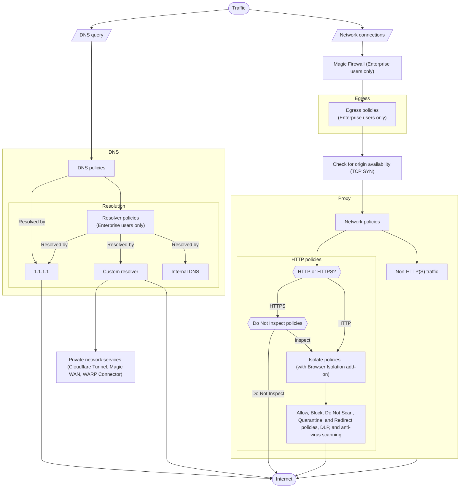

---
{}
---

import { Render, Details } from "~/components";



:::caution[Order of enforcement change on 2025-07-14]
On 2025-07-14, Gateway began evaluating network-level policies before application-level policies and verify the network path to an origin server before accepting a connection. This only affects your policies if you are applying HTTP policies in your account. For example:

<Details header="Comparison of old and new order of enforcement">

|                                                | Old order of enforcement                                                                                               | New order of enforcement                                                                                                                |
| ---------------------------------------------- | ---------------------------------------------------------------------------------------------------------------------- | --------------------------------------------------------------------------------------------------------------------------------------- |
| **Network Block policy and HTTP Block policy** | Gateway blocks traffic and displays the block page and/or follows the client notification settings on the HTTP policy. | Gateway blocks traffic. Gateway does not display the block page but will follow the client notification settings on the Network policy. |
| **Network Allow policy and HTTP Block policy** | Gateway blocks traffic and displays the block page and follows the client notification settings on the HTTP policy.    | No change.                                                                                                                              |
| **Network Block policy and HTTP Allow policy** | Gateway blocks traffic and follows the client notification settings on the Network policy.                             | No change.                                                                                                                              |

</Details>
:::

## Connection establishment

When a user connects to a server with Gateway, Gateway first establishes a TCP connection with the destination server on the port the user requested. Because TCP traffic is proxied by Cloudflare, the connection Gateway establishes with the origin is independent from the connection users establish with Gateway. This means Gateway assigns a new source IP and port to the user's connection and no details from the user's TCP handshake are included in the TCP handshake with the origin server.

If the TCP connection to the destination server is successful, Gateway will apply policies. If Gateway policies allow the connection, Gateway will connect the user to the destination server. If Gateway policies block the connection, Gateway will end the connection and will not send any data between the user and the destination server. If the TCP connection to the destination server is unsuccessful, Gateway will not run any policies and retry TCP connections from the user to the server.

<Render file="gateway/tcp-flowchart" product="cloudflare-one" />

Connections to Zero Trust will always appear in your [Zero Trust network session logs](/logs/logpush/logpush-job/datasets/account/zero_trust_network_sessions/) regardless of connection success. Because Gateway does not inspect failed connections, they will not appear in your [Gateway activity logs](/cloudflare-one/insights/logs/gateway-logs/).

## Priority between policy builders

Gateway applies your policies in the following order:

1. DNS policies with selectors evaluated before resolution
2. Resolver policies (if applicable)
3. DNS policies with selectors evaluated after resolution
4. Network policies
5. Egress policies (if applicable)
6. HTTP policies

DNS and resolver policies are standalone. For example, if you block a site with a DNS policy but do not create a corresponding HTTP policy, users can still access the site if they know its IP address.

### HTTP/3 traffic

For proxied [HTTP/3 traffic](/cloudflare-one/traffic-policies/http-policies/http3/), Gateway applies your policies in the following order:

1. DNS policies
2. Network policies
3. HTTP policies

## Priority within a policy builder

### DNS policies

Gateway evaluates DNS policies first in order of DNS resolution, then in [order of precedence](#order-of-precedence).

When DNS queries are received, Gateway evaluates policies with pre-resolution selectors, resolves the DNS query, then evaluates policies with post-resolution selectors. This means policies with selectors evaluated before DNS resolution take precedence. For example, the following set of policies will block `example.com`:

| Precedence | Selector                        | Operator | Value         | Action |
| ---------- | ------------------------------- | -------- | ------------- | ------ |
| 1          | Resolved Country IP Geolocation | is       | United States | Allow  |
| 2          | Domain                          | is       | `example.com` | Block  |

Despite an explicit Allow policy ordered first, policy 2 takes precedence because the _Domain_ selector is evaluated before DNS resolution.

If a policy contains both pre-resolution and post-resolution selectors, Gateway will evaluate the entire policy after DNS resolution. For information on when each selector is evaluated, refer to the [list of DNS selectors](/cloudflare-one/traffic-policies/dns-policies/#selectors).

### Network policies

Gateway evaluates network policies in [order of precedence](#order-of-precedence).

### HTTP policies

Gateway applies HTTP policies based on a combination of [action type](/cloudflare-one/traffic-policies/http-policies/#actions) and [order of precedence](#order-of-precedence):

1. All Do Not Inspect policies are evaluated first, in order of precedence.
2. If no policies match, all Isolate policies are evaluated in order of precedence.
3. All Allow, Block and Do Not Scan policies are evaluated in order of precedence.
4. The body of the HTTP request, including Data Loss Prevention (DLP), AV scanning, and file sandboxing, is evaluated.

This order of enforcement allows Gateway to first determine whether decryption should occur. If a site matches a Do Not Inspect policy, it is automatically allowed through Gateway and bypasses all other HTTP policies.

:::note
The only exception is if you are using [Clientless Web Isolation](/cloudflare-one/remote-browser-isolation/setup/clientless-browser-isolation/) — all sites within the clientless remote browser are implicitly isolated even if they match a Do Not Inspect policy.
:::

Next, Gateway checks decrypted traffic against your Isolate policies. When a user makes a request which triggers an Isolate policy, the request will be rerouted to a [remote browser](/cloudflare-one/remote-browser-isolation/).

Next, Gateway evaluates all Allow, Block, and Do Not Scan policies. These policies apply to both isolated and non-isolated traffic. For example, if `example.com` is isolated and `example.com/subpage` is blocked, Gateway will block the subpage (`example.com/subpage`) inside of the remote browser.

Lastly, Gateway inspects the body of the HTTP request by evaluating it against DLP policies, and running anti-virus scanning and file sandboxing. If DLP Block policies are present, the action Gateway ultimately takes may not match the action it initially logs. For more information, refer to [DLP policy precedence](#dlp-policy-precedence).

### Resolver policies

When [resolver policies](/cloudflare-one/traffic-policies/resolver-policies/) are present, Gateway first evaluates any DNS policies with pre-resolution selectors, then routes any DNS queries according to the [order of precedence](#order-of-precedence) of your resolver policies, and lastly evaluates any DNS policies with post-resolution selectors.

### Order of precedence

Order of precedence refers to the priority of individual policies within the DNS, network, or HTTP policy builder. Gateway evaluates policies in ascending order beginning with the lowest value.

The order of precedence follows the first match principle. Once traffic matches an Allow or Block policy, evaluation stops and no subsequent policies can override the decision. Therefore, Cloudflare recommends assigning the most specific policies and exceptions with the highest precedence and the most general policies with the lowest precedence.

#### Cloudflare One

In Cloudflare One, policies are in order of precedence from top to bottom of the list. Policies begin with precedence `1` and count upward. You can modify the order of precedence by dragging and dropping individual policies in the dashboard.

#### Cloudflare API

To update the precedence of a policy with the Cloudflare API, use the [Update a Zero Trust Gateway rule](/api/resources/zero_trust/subresources/gateway/subresources/rules/methods/update/) endpoint to update the `precedence` field.

#### DLP policy precedence

For Gateway configurations with DLP policies, Gateway will filter and log traffic based on first match, then scan the body of the HTTP request for matching content. Because of the first match principle, Gateway may perform and log a decision for traffic, then perform a contradicting decision. For example, if traffic is first allowed with an Allow HTTP policy, then blocked with a DLP Block policy, Gateway will log the initial Allow action despite ultimately blocking the request.

#### Access applications

If Gateway traffic is headed to a private IP address protected as an Access application, that traffic will still be evaluated by the destination application's Access policies, even if a Gateway Allow policy matched first. Gateway Block policies that match traffic will terminate any other policy evaluation. This is expected behavior. A Gateway Allow policy does not override or bypass Access policies.

<Render file="gateway/terraform-precedence-warning" product="cloudflare-one" />

## Example

Suppose you have a list of policies arranged in the following order of precedence:

- DNS policies:

  | Precedence | Selector | Operator      | Value              | Action |
  | ---------- | -------- | ------------- | ------------------ | ------ |
  | 1          | Host     | is            | `example.com`      | Block  |
  | 2          | Host     | is            | `test.example.com` | Allow  |
  | 3          | Domain   | matches regex | `.\`               | Block  |

- HTTP policies:

  | Precedence | Selector | Operator | Value               | Action         |
  | ---------- | -------- | -------- | ------------------- | -------------- |
  | 1          | Host     | is       | `example.com`       | Block          |
  | 2          | Host     | is       | `test2.example.com` | Do Not Inspect |

- Network policies:

  | Precedence | Selector         | Operator | Value              | Action |
  | ---------- | ---------------- | -------- | ------------------ | ------ |
  | 1          | Destination Port | is       | `80`               | Block  |
  | 2          | Destination port | is       | `443`              | Allow  |
  | 3          | SNI Domain       | is       | `test.example.com` | Block  |

When a user goes to `https://test.example.com`, Gateway performs the following operations:

1. Evaluate DNS request against DNS policies:
   1. Policy #1 does not match `test.example.com` — move on to check Policy #2.
   2. Policy #2 matches, so DNS resolution is allowed.
   3. Policy #3 is not evaluated because there has already been an explicit match.

2. Evaluate HTTPS request against HTTP policies:
   1. Policy #2 is evaluated first because Do Not Inspect [always takes precedence](#http-policies) over Allow and Block. Since there is no match, move on to check Policy #1.
   2. Policy #1 does not match `test.example.com`. Since there are no matching Block policies, the request passes the HTTP filter and moves on to network policy evaluation.

3. Evaluate HTTPS request against network policies:
   1. Policy #1 does not match because port 80 is used for standard HTTP, not HTTPS.
   2. Policy #2 matches, so the request is allowed and proxied to the upstream server.
   3. Policy #3 is not evaluated because there has already been an explicit match.

Therefore, the user is able to connect to `https://test.example.com`.

## Precedence calculations

When arranging policies in Zero Trust, Gateway automatically calculates the precedence for rearranged policies.

When using the API to create a policy, unless the precedence is explicitly defined in the policy, Gateway will assign precedence to policies starting at `1000`. Every time a new policy is added to the bottom of the order, Gateway will calculate the current highest precedence in the account and add a random integer between 1 and 100 to `1000` so that it now claims the maximum precedence in the account. To manually update a policy's precedence, use the [Update a Zero Trust Gateway rule](/api/resources/zero_trust/subresources/gateway/subresources/rules/methods/update/) endpoint. You can set a policy's precedence to any value that is not already in use.

Changing the order within Cloudflare One or API may result in configuration issues when using [Terraform](#manage-precedence-with-terraform).

## Manage precedence with Terraform

You can manage the order of execution of your Gateway policies using Terraform. With version 5 of the Terraform Cloudflare provider, Gateway users can list their policies in a Terraform file with any desired integer precedence value. Cloudflare recommends starting with a precedence of `1000` and adding extra space between each policy's precedence for any future policies. For example:

```tf
resource "cloudflare_zero_trust_gateway_policy" "policy_1" {
  account_id = var.cloudflare_account_id
  # other attributes...
  precedence = 1000
}

resource "cloudflare_zero_trust_gateway_policy" "policy_2" {
  account_id = var.cloudflare_account_id
  # other attributes...
  precedence = 2000
}

resource "cloudflare_zero_trust_gateway_policy" "policy_3" {
  account_id = var.cloudflare_account_id
  # other attributes...
  precedence = 3000
}
```

To avoid precedence calculation errors when reordering policies with Terraform, you should move one policy at a time before running `terraform plan` and `terraform apply`. If you use both Terraform and Cloudflare One or API, sync your polices with `terraform refresh` before reordering policies in Terraform. Alternatively, you can set your account to [read-only in Cloudflare One](/cloudflare-one/api-terraform/#set-dashboard-to-read-only), only allowing changes using the API or Terraform.
