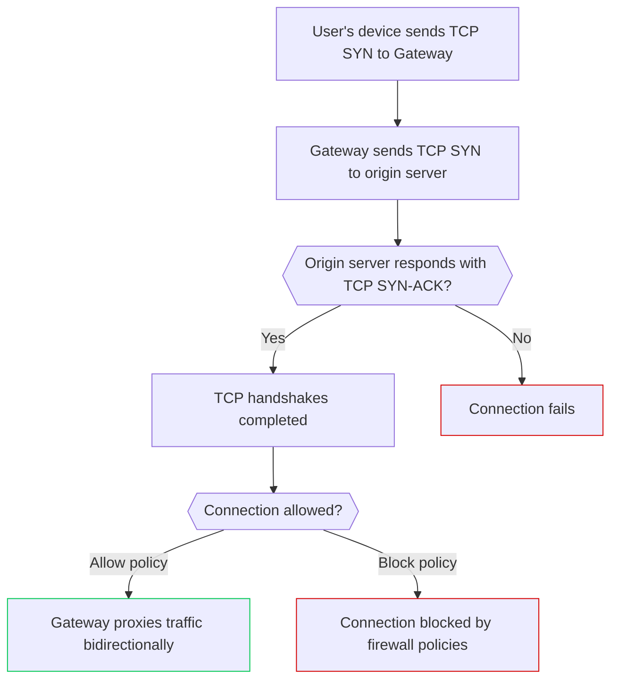

---
{}
---

```mermaid
flowchart TD
    %% Accessibility
    accTitle: How Gateway proxy works
    accDescr: Flowchart describing how the Gateway proxy uses the Happy Eyeballs algorithm to establish TCP connections and proxy user traffic.

    %% Flowchart
    A[User's device sends TCP SYN to Gateway] --> B[Gateway sends TCP SYN to origin server]
    B --> C{{Origin server responds with TCP SYN-ACK?}}
    C -->|Yes| E[TCP handshakes completed]
    C -->|No| D[Connection fails]
    E --> F{{Connection allowed?}}
    F -->|Allow policy| G[Gateway proxies traffic bidirectionally]
    F -->|Block policy| H[Connection blocked by firewall policies]

    %% Styling
    style D stroke:#D50000
    style G stroke:#00C853
    style H stroke:#D50000
```
