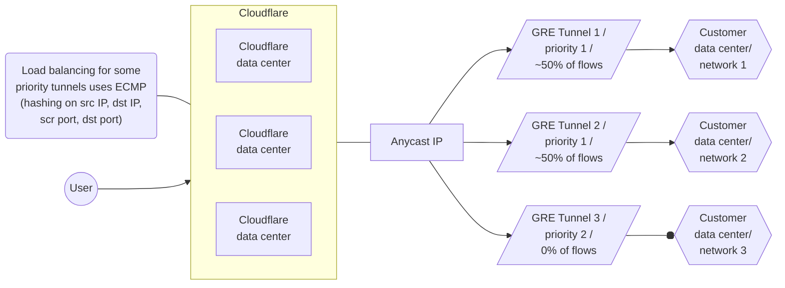
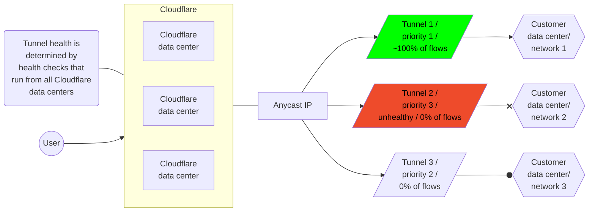
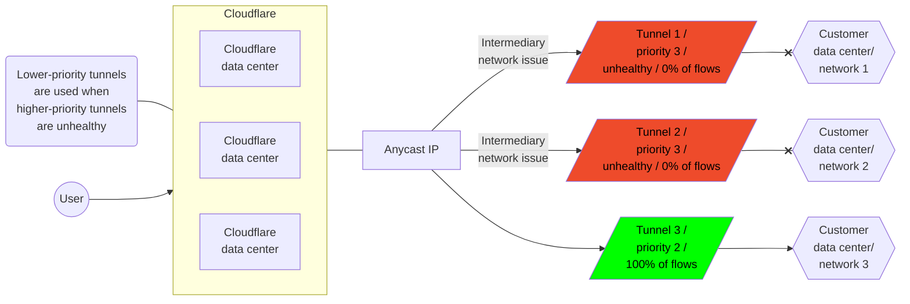

---
params:
  - magicWord
  - productName
  - mFirewallName
  - mFirewallURL
  - warpClientURL
  - remoteBrowserURL
  - accessURL
  - gatewayURL
  - cfTunnelURL?
  - greIpsecReferenceURL
  - createStaticRoute
  - editStaticRoute
  - setupBgpPeering
  - legacyHCs
  - tunnelHCsPage
---

import { AnchorHeading, Aside, Markdown, Render } from "~/components";

## Magic routing table

The Magic networking routing table is a virtual network overlay, private to your account, that spans all Cloudflare data centers globally. This overlay network provides:

- Magic Transit delivery for [DoS](/ddos-protection/) and <a href={props.mFirewallURL}>{props.mFirewallName}</a> filtered Internet traffic, from the entry data center where the traffic ingressed, to your publicly addressed edge/border network.
- {props.productName} packet transport between Magic tunnels, interconnects, [Cloudflare Load Balancer](/load-balancing/), and [Zero Trust](/cloudflare-one/) connections such as <a href={props.warpClientURL}>WARP Client</a>, <a href={props.remoteBrowserURL}>Remote Browser Isolation</a>, <a href={props.accessURL}>Access</a>, and <a href={props.gatewayURL}>Gateway</a>.

The Magic routing table supports routing the {props.productName} traffic via anycast tunnels using <a href={props.greIpsecReferenceURL}>GRE and Internet Protocol Security (IPsec)</a> or [Direct Cloudflare Network Interconnect (CNI)](/network-interconnect/). Entries can be added to the Magic routing table via static route configuration or via routes learned through BGP peering (only available over Direct CNI).

### Allowed IP ranges

The following IPv4 address ranges are allowed in the Magic Routing table:

{ props.magicWord === "Magic Transit" && (
  <>
		<Markdown
    text={`
		- [BYOIP](/byoip/) public address space which you have onboarded to Cloudflare Magic Transit.
		- Cloudflare [leased IPs](/magic-transit/cloudflare-ips/) assigned to your account.
			`}
				inline={false}
  />
  </>
  )
}

{ props.magicWord !== "Magic Transit" && (
  <>
		<Render
			file="routing/magic-wan-allowed-ip-ranges"
			product="networking-services"
			params={{
				productName: props.productName,
				cfTunnelURL: props.cfTunnelURL
			}}
		/>
  </>
  )
}

### Route prioritization

{props.productName} is steered along tunnel routes based on priorities of route entries.

- Lower values have greater priority.
- When the priority values for prefix entries match, Cloudflare uses [equal-cost multi-path (ECMP)](#equal-cost-multi-path-routing) packet forwarding to route traffic. An optional weight value can be applied to static routes to [modify ECMP tunnel distribution](#set-priority-and-weights-for-static-routes).
- <Render file="longest-prefix-match" product="networking-services/reference" />
- When BGP and static routes have the same prefix and priority, Cloudflare enforces priority by preferring static routes over BGP routes. This ensures that manually configured static routes take precedence unless explicitly deprioritized.

### Set priority and weights for static routes

The priority value for static routes is directly configured as part of the route object in the Cloudflare <a href={props.createStaticRoute}>dashboard or via API</a>. For example:


| Prefix | NextHop | Priority |
| ----- | ----- | ----- |
| `10.10.10.100/24` | `TUNNEL_1_IAD` | `200` |
| `10.10.10.100/24` | `TUNNEL_2_IAD` | `200` |
| `10.10.10.100/24` | `TUNNEL_3_ATL` | `100` |
| `10.10.10.100/24` | `TUNNEL_4_ATL` | `100` |

In the example above, tunnels with priority of `100` will be preferred to tunnels with priority of `200` since lower numbers have greater priority.

Optionally, you can assign weights to distribute traffic more effectively among multiple tunnels. The weight values determine the proportion of traffic directed to each tunnel, with higher weights resulting in a greater share of traffic. The maximum weight value is `256`.

In the example below, `TUNNEL_2_IAD` is likely to receive twice as much traffic as `TUNNEL_1_IAD`.

| Prefix | NextHop | Priority | Weight |
| ----- | ----- | ----- | ----- |
| `10.10.10.100/24` | `TUNNEL_1_IAD` | `100` | `64` |
| `10.10.10.100/24` | `TUNNEL_2_IAD` | `100` | `128` |
| `10.10.10.100/24` | `TUNNEL_3_ATL` | `100` | `192` |
| `10.10.10.100/24` | `TUNNEL_4_ATL` | `100` | `255` |

Aside from priority, scoping static routes to specific geographic regions will also impact how traffic is steered. Refer to [Scoping routes to specific regions](#scoping-routes-to-specific-regions) for more details.

### Set priority for BGP routes

When BGP advertises a route, it is automatically added to the Magic routing table with a default priority of `100` which applies to [all regions](#scoping-routes-to-specific-regions). However, if a static route exists with the same prefix and priority, the static route will always take precedence over the BGP route. You will have to set a different priority for static routes, to be more or less than `100`, depending on which you want to prioritize. Lower values have greater priority.

Additionally, when multiple BGP routes exist with the same prefix length and priority, traffic is distributed across them using [equal-cost multi-path (ECMP) routing](#equal-cost-multi-path-routing).

### Change route priorities with BGP attributes

Cloudflare supports traffic engineering via BGP communities and AS prepending. You can use these traffic routing techniques to set route priorities and perform traffic engineering across multiple interconnects.

#### BGP communities for setting route priority

The default BGP route priority is `100`. This base priority can be adjusted using communities. For example, when a route is tagged with the community `13335:60010` its priority is set to `10`. This makes it a higher priority than the default of `100` because lower numeric priorities are preferred.

The community values supported for setting base route priority are:

- `13335:60010`: Set base Magic route priority to `10`
- `13335:60050`: Set base Magic route priority to `50`
- `UNSET`: Set base Magic route priority to `100`
- `13335:60150`: Set base Magic route priority to `150`
- `13335:60200`: Set base Magic route priority to `200`
- `13335:60901`: Set base Magic route priority to `501000`
- `13335:60902`: Set baseMagic route priority to `1001000`

It is considered a misconfiguration to set multiple base priority communities in the same prefix update message. In this situation the highest priority (lowest integer value) is preferred.

#### AS path prepending for adjusting route priority

For each additional mention of the customer ASN in the received AS path an additional `10` is added to the route's base priority. By increasing the priority number, the route is less preferred.

For example, if your ASN is `65000` then the `BGP UPDATE` to Cloudflare will be:

```txt
# No change to base priority.
AS_PATH: 65000 65200

# Add 10 to base priority for 1 prepend of 65000
AS_PATH: 65000 65000 65200

# Add 20 to base priority for 2 prepend of 65000
AS_PATH: 65000 65000 65000 65200
```

#### How communities and prepends work together

Cloudflare adjusts route priority when using AS prepending with communities. For example, if a route is tagged with `13335:60150`, the base priority is set to `150`. If you prepend your ASN twice, Cloudflare adds `10` for each prepend, increasing the route priority to `180`.

## Scoping routes to specific regions

If you have multiple connectivity paths to a network segment and you would like to apply different route prioritization based on where the traffic arrives at the Cloudflare network, you can scope routes to specific Cloudflare data center regions. This is useful, for example, if you run your own anycast network and want your end-user traffic to arrive at your network location closest to the user. When a route is scoped to a Cloudflare data center region it will only show up in the Magic routing table in that region, along with all global routes that do not have any region scope. Route prioritization and ECMP logic apply across both region-scoped and global routes.

:::note
Scoping routes to specific regions is not supported with BGP peering, and is only available to statically configured routes at this time.
:::

When using region-scoped routes, you should ensure that all prefixes have routes covering all regions. Otherwise, traffic may arrive at a Cloudflare region which is not covered by any route, in which case the traffic will be dropped.

The following table exemplifies how to use geographic scoping for routes:

| Prefix | NextHop | Priority | Region code |
| ----- | ----- | ----- | ----- |
| `10.10.10.100/24` | `TUNNEL_1_IAD` | `100` | `AFR` |
| `10.10.10.100/24` | `TUNNEL_2_IAD` | `100` | `EEUR` |
| `10.10.10.100/24` | `TUNNEL_3_ATL` | `100` | `ENAM` |
| `10.10.10.100/24` | `TUNNEL_4_ATL` | `100` | `ME` |
| `10.10.10.100/24` | `TUNNEL_5_ATL` | `100` | `WNAM` |
| `10.10.10.100/24` | `TUNNEL_4_ATL` | `100` | `ENAM` |

When there are multiple routes to the same prefix with equal priority, and those routes are assigned to different geographic regions (like WNAM and ENAM), traffic entering the network in a specific region — for example, WNAM — will egress through the route associated with that same region.

{ props.magicWord === "Magic Transit" && (
  <>
		<Render file="routing/anycast-warning" product="networking-services" />
	</>
)
}

### Region codes and associated regions

<Render file="traffic-steering-region-codes" product="networking-services/reference" />

Configure scoping for your traffic in the **Region code** section when adding or editing a static route. Refer to <a href={props.createStaticRoute}>Create a static route</a> and <a href={props.editStaticRoute}>Edit a static route</a> more information.

{ props.magicWord === "Magic Transit" && (
  <>
    <AnchorHeading title="Magic Transit prefix mapping" depth={2} />
    <AnchorHeading title="Map route prefixes smaller than `/24`" depth={3} />
		<Markdown
    text={`
		You must provide your prefixes and the tunnels that should be mapped to for Cloudflare to route your traffic from our global network to your data centers via anycast tunnels. Use the table below as reference.

  | Prefix            | NextHop        |
  | ----------------- | -------------- |
  | \`103.21.244.0/29\` | \`TUNNEL_1_IAD\` |
  | \`103.21.244.8/29\` | \`TUNNEL_2_ATL\` |

		The minimum advertising prefix is \`/24\`, but because Cloudflare uses anycast tunnels as an outer wrapper for your traffic, we can route prefixes within that \`/24\` to different tunnel endpoints. For example, you can send \`x.x.x.0/29\` to Data Center 1 and \`x.x.x.8/29\` to Data Center 2. This is helpful when you operate in an environment with constrained IP resources.
  `}
    inline={false}
  />

		<AnchorHeading title="Map routes prefixes bigger than onboarded prefixes" depth={3} />
		<Markdown
    text={`
		If you have multiple onboarded \`/24\` subnets that belong to a larger contiguous block, you can configure a summary static route for the corresponding supernet (like a \`/23\` or a \`/22\`) instead of adding each \`/24\` individually. This eliminates the need to configure each \`/24\` route individually, as all traffic will be routed through the same GRE tunnels.

		For example, if you have two tunnels:

		- \`192.0.2.0/24\`
		- \`192.0.3.0/24\`

		You can summarize these into a single \`192.0.2.0/23\`.

		Refer to [Add tunnels](/magic-transit/how-to/configure-tunnel-endpoints/#add-tunnels) to learn more about configuring GRE tunnels.
			`}
				inline={false}
  />
	<Aside type="note">These address blocks are a part of <a href="https://datatracker.ietf.org/doc/rfc5737/" target="_blank" rel="noopener noreferrer">RFC 5737</a> and are reserved for use as examples in documentation.</Aside>
  </>
  )
}

## Equal-cost multi-path routing

Equal-cost multi-path routing uses hashes calculated from [packet](https://www.cloudflare.com/learning/network-layer/what-is-a-packet/) data to determine the route chosen. The hash always uses the source and destination IP addresses. For TCP and UDP packets, the hash includes the source and destination ports as well. The ECMP algorithm divides the hash for each packet by the number of equal-cost next hops. The modulus (remainder) determines the route the packet takes.

Using ECMP has a number of consequences:

- Routing to equal-cost paths is probabilistic.
- Packets in the same session (or flow) with the same source and destination have the same hash. The packets also use the same next hop.
- Routing changes in the number of equal-cost next hops can cause traffic to use different tunnels. For example, dynamic reprioritization triggered by health check events can cause traffic to use different tunnels.

As a result, ECMP provides load balancing across tunnels with the same prefix and priority.

:::note
Packets in the same flow use the same tunnel unless the tunnel priority changes. Packets for different flows can use different tunnels depending on which tunnel the flow's 4-tuple — source and destination IP and source and destination port — hash to.
:::

### Examples

This diagram illustrates how ECMP distributes traffic equally across two paths with the same prefix and priority.

#### Normal traffic flow



#### Failover traffic flow: Scenario 1

**Customer router failure**

When {props.productName} health checks determine that Tunnel 2 is unhealthy, that route is dynamically de-prioritized, leaving Tunnel 1 with the sole top-priority route. As a result, traffic is steered away from Tunnel 2, and all traffic flows to Tunnel 1.



#### Failover traffic flow: Scenario 2

**Intermediary ISP failure**

When {props.productName} determines that Tunnel 1 is unhealthy as well, that route is also de-prioritized, leaving Tunnel 3 with the top priority route. In that case, all traffic flows to Tunnel 3.



When {props.productName} determines that Tunnels 1 and 2 are healthy again, it re-prioritizes those routes, and traffic flow returns to normal.

### ECMP and bandwidth utilization

Because ECMP is probabilistic, the algorithm routes roughly the same number of flows through each tunnel. However it does not consider the amount of traffic already sent through a tunnel when deciding where to route the next packet.

For example, consider a scenario with many very low-bandwidth TCP connections and one very high-bandwidth TCP connection. Packets for the high-bandwidth connection have the same hash and thus use the same tunnel. As a result, that tunnel utilizes greater bandwidth than the others.

:::note[Note]
{props.productName} supports a weight field that you can apply to a route so that a specified percentage of traffic uses a certain tunnel rather than other equal-cost tunnels. Refer to [Route prioritization](#route-prioritization) for more information.

For example, in a scenario where you want to route 70% of your traffic through ISP A and 30% through ISP B, you can use the weight field to help achieve that.

Note that because ECMP balances flows probabilistically, the use of weights is only approximate.

For more on {props.productName} tunnel weights, contact your Cloudflare customer service manager.
:::

## BGP information

When using a [Direct CNI](/network-interconnect/) connection as an on-ramp, {props.productName} customers can also use BGP peering between their networks and their Magic routing table.

Using BGP peering with a CNI allows customers to:

- Automate the process of adding or removing networks and subnets.
- Take advantage of failure detection and session recovery features.

With this functionality, customers can:

- Establish an eBGP session between their devices and the {props.productName} service when connected via CNI.
- Secure the session by MD5 authentication to prevent misconfigurations.
- Exchange routes dynamically between their devices and their Magic routing table.

### BGP peering with the Magic routing table

{props.productName} BGP peering is with the Magic networking routing table (as opposed to peering with the Cloudflare Internet global network). BGP peers configured by following this guide will receive advertisements for all prefixes in the Magic routing table plus any additional prefixes configured in the per-interconnect <a href={props.setupBgpPeering}>Advertised prefix list</a>.

If instead you are seeking to do public peering with the Cloudflare ASN 13335 at one of the Cloudflare data centers, refer to [PNI and peering setup](/network-interconnect/). Note that it is not currently possible to share Magic network BGP peering and PNI on the same physical interconnect port.

### BGP route distribution and convergence

Routes received from the customer device will be redistributed into the Magic routing table, which is used by both {props.productName} and Magic Transit.

All routes in the Magic routing table are advertised to BGP peers. Each BGP peer will receive each prefix route along with the full `AS_PATH`, with the selected Cloudflare side [ASN](https://www.cloudflare.com/learning/network-layer/what-is-an-autonomous-system/) prepended. This is so that the peer can accurately perform [loop prevention](https://datatracker.ietf.org/doc/html/rfc4271#section-9.1.2).

BGP peering sessions can advertise reachable prefixes to a peer and withdraw previously advertised prefixes. This should not take more than a few minutes to propagate.

### BGP timers and settings

Cloudflare uses the timers as described below. These are not configurable:

| Setting | Description |
| ----- | ----- |
| **Hold timer** | 240 seconds <br /> (_To establish a session, Cloudflare will compare our hold timer and the peer's hold timer, and use the smaller of the two values to establish the BGP session._) |
| **Keepalive timer** | One third of the hold time. |
| **Graceful restart** | 120 seconds |

- **Hold timer**: Specifies the maximum amount of time that a BGP peer will wait to receive a keepalive, update, or notification message before declaring the BGP session down. Cloudflare will use the smaller of this default hold time and that received from the peer in the open message.
- **Keepalive timer**: BGP systems exchange keepalive messages to determine whether the peer router is reachable. If keepalive messages are not received within the Hold Timer, the session is assumed to be down, indicating that the peer is no longer reachable at the BGP protocol level.
- **Graceful restart timer**: Tracks how long a router will wait for a peer to re-establish a BGP session after the peer initiates a graceful restart. If the peer does not reconnect within this time, the router declares the session down and removes stale routes.

### BGP limitations

BGP multipath is supported. If the same prefix is learned on two different interconnects then traffic destined for that prefix will be distributed across each interconnect according to the usual ECMP behavior.

BGP support currently has the following limitations:

- The Cloudflare account ASN and the customer device ASN must be different. Only eBGP is supported.
- Routes are always injected with a priority of `100`.
- Bidirectional Forwarding Detection (BFD) is not supported.
- Only IPv4 routes are supported.

{ props.magicWord === "Magic Transit" && (
  <>
    <p>For Magic Transit customers, BGP with the Magic routing table is separated from the announcement of anycast prefixes at the Cloudflare edge. Anycast withdrawal must be controlled with existing methods documented in <a href="/magic-transit/how-to/advertise-prefixes/">Advertise prefixes</a>.</p>
  </>
  )
}

### Tunnel health checks

{props.productName} customers need to enable <a href={props.legacyHCs}>legacy health checks</a> alongside BGP. This is essential to determine if a specific Cloudflare data center is reachable from a customer device or not. <a href={props.tunnelHCsPage}>Tunnel health checks</a> will modify the route's priorities for dynamically learned BGP routes.


{ props.magicWord !== "Magic Transit" && (
  <>
		<AnchorHeading title="Application-aware policies" depth={2} />
    <p>By default, Cloudflare balances and steers traffic based on network-layer characteristics (IP, port etc). If you are using the {props.productName} Connector, you can also steer traffic based on well-known applications. Application-aware policies provide easier management and more granularity over traffic flows.

		For more information, refer to <a href="/cloudflare-one/traffic-policies/application-app-types/">Applications and app types</a>.</p>
  </>
  )
}
